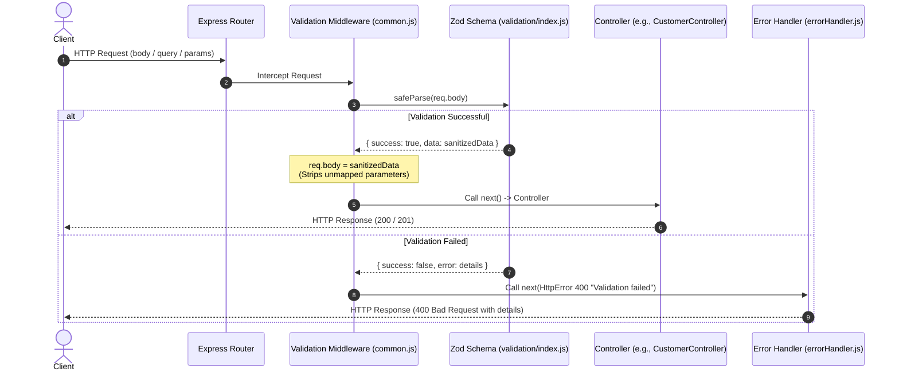

# Velora Validation Architecture

This document maps and explains the validation architecture used in the Velora Backend. The system leverages **Zod** for schema definition and **Express Middleware** to intercept, validate, and sanitize incoming request payloads before they reach controllers.

---

## Architecture Flow Diagram

Below is a visual representation of how validation acts as a guardrail for all incoming requests:



---

## Core Components

The validation system is divided into three distinct layers:

### 1. Schema Definitions (`Backend/validation/`)
This layer defines the raw validation rules using Zod.
- **Organization**: Subdirectories group schemas by domain (e.g. `login`, `register`, `customer`, `product`, `store`, `review`, `general`).
- **Aggregation (`validation/index.js`)**: All schema modules are imported and aggregated into a single entrypoint using the spread operator (`...`), making imports clean and centralized.

### 2. Validation Wrapper (`Backend/middleware/validation/common.js`)
This module exports generic validation wrapper functions that connect Zod to Express request targets:
- `validateBody(schema)`: Validates `req.body`
- `validateQuery(schema)`: Validates `req.query`
- `validateParams(schema)`: Validates `req.params`

#### Key Feature: Strict Sanitization
In `createValidator` inside [common.js](file:///c:/Users/Omid/Desktop/Code/Velora/Backend/middleware/validation/common.js), if validation succeeds, `req[target]` is overwritten with `parsed.data`:
```javascript
req[target] = parsed.data; // Only keeps fields explicitly defined in the Zod schema
```
This automatically strips out any unexpected or malicious parameters from the payload before reaching the controller.

### 3. Route Adapters (`Backend/middleware/validation/`)
Adapters like [CustomerValidation.js](file:///c:/Users/Omid/Desktop/Code/Velora/Backend/middleware/validation/CustomerValidation.js) and [StoreOwnerValidation.js](file:///c:/Users/Omid/Desktop/Code/Velora/Backend/middleware/validation/StoreOwnerValidation.js) combine Zod schemas with the common validation creators to produce named Express middlewares:
```javascript
// Example from CustomerValidation.js
module.exports = {
  validateCreateCustomer: validateBody(registerSchema),
  validateCustomerLogin: validateBody(loginSchema),
  validateConfirmCustomerPasswordReset: validateBody(passwordResetConfirmSchema),
};
```
These middlewares are directly attached to the HTTP routes:
```javascript
// Example from Post_customer.js
router.post("/password-reset/confirm", authLimiter, validateConfirmCustomerPasswordReset, confirmCustomerPasswordReset);
```

---

## Directory Structure

```
Backend/
├── middleware/
│   └── validation/
│       ├── common.js              # Generic middleware factory
│       ├── CustomerValidation.js  # Express adapters for Customer routes
│       ├── StoreOwnerValidation.js# Express adapters for Seller routes
│       └── ...                    # Other resource validation adapters
└── validation/
    ├── index.js                   # Single central export entrypoint
    ├── general/                   # General shared schemas (Auth, ObjectIds)
    ├── customer/                  # Schema rules for customer profile, addresses
    ├── login/                     # Schema rules for Customer & Seller logins
    └── register/                  # Schema rules for Customer & Seller registration
```
