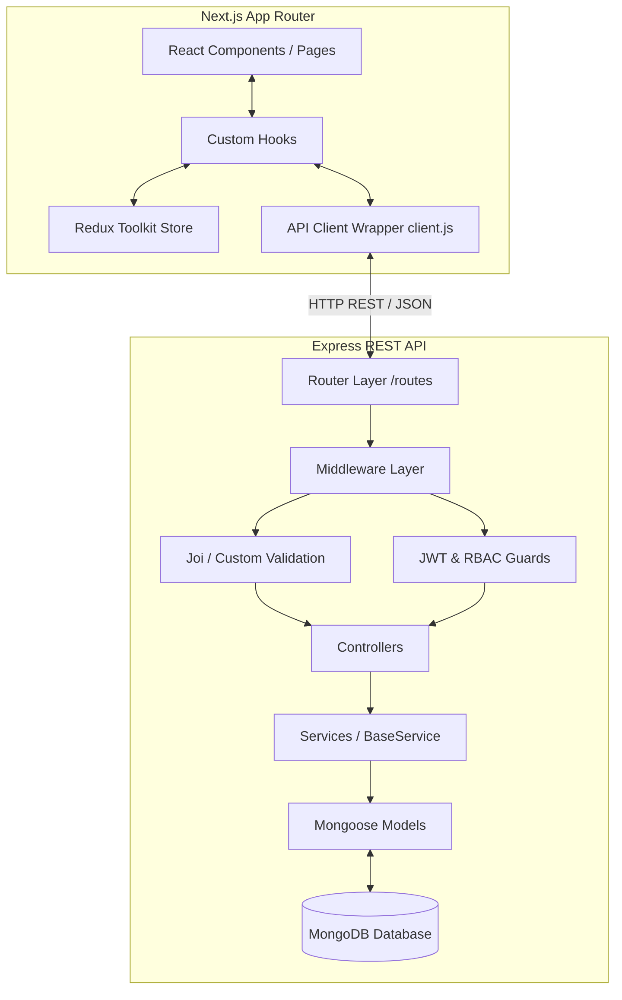
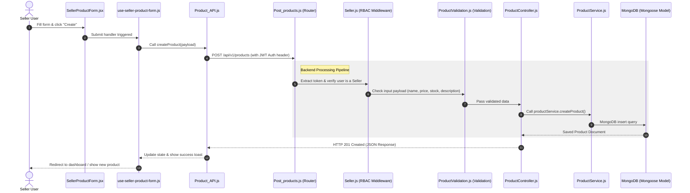

**After a year of development: Personal Project — Velora (E-Commerce)**

I can say with certainty and confidence:  
Today’s Velora consists of **296 files**, **115 folders**, and approximately **12,000–14,000 lines of hand-written code** (scaling to 35,000+ lines including package configurations and dependency lockfiles).

### What I Have Achieved in a Year

- Architected a modular Next.js frontend using a feature-based folder structure (`features/` containing localized hooks, services, and components), streamlining code maintenance and scalability across 7 core domains.
- Designed a MongoDB/Mongoose database layer with a reusable BaseService query abstraction, eliminating redundant query code across 12 distinct backend services.
- Implemented secure role-based access control (RBAC) on the backend via custom JWT extraction and authorization middleware, protecting sensitive endpoints for both Customers and Sellers.
- Developed a dual-role workflow featuring a customer-facing marketplace (cart, checkout, product review system) and a dedicated Seller Panel (`app/seller`) with store onboarding and product management dashboards.
- Integrated Stripe payments and automated webhook processing in the Express backend, ensuring secure checkout flows and real-time database state synchronization.
- Optimized SEO indexability and metadata across the Next.js App Router, utilizing dynamic OpenGraph (`opengraph-image.js`), Twitter cards, robots, and automated sitemaps.
- Created a centralized validation middleware architecture using schema-based validations across 10+ core models, preventing corrupt or malformed inputs from reaching the database.
- Managed global client state (Auth, Basket, and User profile) using Redux Toolkit slices, ensuring predictable state transitions and eliminating prop-drilling across the Next.js App Router.
- Engineered a custom API client wrapper with interceptors for header injection and token refreshing, facilitating clean, authenticated backend communication for the frontend app.
- Established an automated testing suite using Jest, covering crucial integration scenarios such as auth, controller actions, mailer behaviors, and database connection setups.

### A Demonstration of Velora’s Architecture

Velora uses a clean, decoupled monorepo architecture separating a high-performance Next.js App Router Frontend from a robust Node.js/Express REST API Backend.

**High-Level System Design**



### How Things Are Handled

**1. The Backend (Express REST API)**  
The backend follows a strict layered controller-service-model pipeline to maintain a clean separation of concerns:

- **Entry (Server.js)**: Boots the application, configures global middleware (CORS, body parsers, logging), connects to MongoDB (`database/MongoDB.js`), and mounts the API routes.
- **Routing (`routes/versionOne/`)**: Maps paths to middleware chains (e.g., `/api/v1/products`).
- **Middleware (`middleware/`)**: Automatically intercepts requests for rate-limiting, JWT signature extraction (token/verification), role-based checking (`auth/system/`), and Joi payload validation (`validation/`).
- **Controllers (`controller/`)**: Act as the adapters. They extract parameters and payload details, call the service layer, and map the return data into HTTP status codes and JSON responses.
- **Services (`services/`)**: Where all business logic lives (Stripe calculations, password hashing, mailer notifications). Database services inherit from a BaseService which acts as a reusable repository layer.
- **Models (`model/`)**: Defines database collections, indexes, and Mongoose schemas.

**2. The Frontend (Next.js 14)**  
The frontend relies on a Feature-Folder design pattern to prevent layout coupling:

- **Features (`src/app/features/`)**: All files are grouped under functional domains (e.g., auth, catalog, seller, order). Each domain packages its own localized UI components, state management hooks (e.g., `use-checkout-form.js`), API service triggers, and helpers.
- **Global State (`redux/`)**: Shared client state (user login session, active basket, UI popup states) is managed using Redux Toolkit slices.
- **API Client (`src/api/client.js`)**: A unified API interface layer configuring endpoint routing, custom headers injection, and handling standardized error interceptors.

### End-to-End Control Flow Example: Creating a Product

Here is the lifecycle of a typical request when a Seller adds a new product to their store:



One year of deliberate architecture, separation of concerns, and shipping features that actually work end-to-end.  
Velora is the result.


# Velora — Project To-Do List

> Last updated: **18 July 2026**  
> This document tracks every outstanding task across the Backend and Frontend.  
> Work through each section top-to-bottom. Check items off as they are completed.

---

## Table of Contents

1. [Backend — Store API](#1-backend--store-api)
2. [Backend — Database Schema Fixes](#2-backend--database-schema-fixes)
3. [Backend — Business Rule: Mandatory Store Before Product](#3-backend--business-rule-mandatory-store-before-product)
4. [Backend — Validation, Auth & Token Audit](#4-backend--validation-auth--token-audit)
5. [Frontend — Search Bar Fix](#5-frontend--search-bar-fix)
6. [Frontend — Product Card: Show Store Name](#6-frontend--product-card-show-store-name)
7. [Frontend — Add-to-Basket Popup](#7-frontend--add-to-basket-popup)
8. [Frontend — Mandatory Auth Popup (Cart & Buy)](#8-frontend--mandatory-auth-popup-cart--buy)
9. [Frontend — Seller Panel Full Redesign](#9-frontend--seller-panel-full-redesign)
10. [Frontend — Better Customer Account Page](#10-frontend--better-customer-account-page)
11. [Frontend — Optional Login Popup on Site Open](#11-frontend--optional-login-popup-on-site-open)
12. [Rebrand / Copyright](#12-rebrand--copyright)

---

## 1. Backend — Store API

### Current State

Implemented seller store endpoints for `/store`:
| Method | Route | Status |
|--------|-------|--------|
| `POST` | `/store` | ✅ Done |
| `GET` | `/store` | ✅ Done — returns the **logged-in owner's own** store |
| `PATCH` | `/store/:id` | ✅ Done (seller only) |
| `DELETE` | `/store/:id` | ✅ Done (seller only) |

### Missing Endpoints to Implement

#### 1.1 `GET /stores` — Get All Stores (public)

- [x] Add `getAllStores` handler in `StoreController.js`
- [x] Add `getAllStores()` method in `StoreService.js` (use `this.model.find({}).sort({ createdAt: -1 })`)
- [x] Create route file `Backend/routes/versionOne/store/Get_all_stores.js`
  - No auth required — public endpoint
- [x] Register the route in `Backend/routes/versionOne/store/index.js`

#### 1.2 `GET /stores/:id` — Get Store By ID (public)

- [ ] Add `getStoreById` handler in `StoreController.js`
  - Validate `:id` is a valid ObjectId, return 400 if not
  - Return 404 if store not found
- [ ] Add `getStoreById(id)` method in `StoreService.js` (use `this.findById(id)`)
- [ ] Add route in `Get_store.js` (or a dedicated `Get_store_by_id.js`)
  - `router.get("/:id", validateStoreId, getStoreById)` — no auth required
- [ ] Add `validateStoreId` middleware in `StoreValidation.js`

#### 1.3 `PATCH /store/:id` — Patch Store By ID (seller only)

- [ ] Add `patchStoreById` handler in `StoreController.js` (partial: implemented as `patchStoreData`, but explicit 403 ownership error is still missing)
  - Verify `req.user.id === store.ownerOfStore` — 403 if not the owner
  - Only update fields that are present in `req.body` (partial update)
- [x] Add `updateStore(id, patch)` method in `StoreService.js` (implemented as `patchStoreData`)
- [x] Create route `PATCH /store/:id` with `requireSeller` + `validatePatchStore` middleware
- [x] Add `validatePatchStore` middleware in `StoreValidation.js` (all fields optional, same rules as create)

#### 1.4 `DELETE /store/:id` — Delete Store By ID (seller only)

- [ ] Add `deleteStoreById` handler in `StoreController.js` (partial: implemented as `deleteStore`, but explicit 403 ownership error is still missing)
  - Verify `req.user.id === store.ownerOfStore` — 403 if not the owner
  - Decide: **hard delete** or **soft delete** (add `isDeleted` flag to `Store` schema). Soft delete is recommended.
  - If soft delete → add `isDeleted: { type: Boolean, default: false }` to `StoreSchema`
- [x] Add `deleteStore(id)` / `softDeleteStore(id)` method in `StoreService.js` (currently hard delete)
- [x] Create route `DELETE /store/:id` with `requireSeller`
- [ ] Consider cascading: when a store is deleted, should its products be soft-deleted too? Decision needed.

#### 1.5 General Store Debugging

- [x] `StoreController.js` — `getStoreData` does **not** guard against `req.user` being undefined (fixed: route now uses `requireSeller`).
- [x] `StoreService.js` — `getStoreData` calls `findOne({ ownerOfStore: ownerId })`. If no store exists yet it returns `null`. The controller returns `{ data: null }` — the frontend should handle this gracefully; add a proper 404 or empty-state response. (updated to list-based empty-state behavior)
- [ ] Test all four new endpoints with the Postman collection (`Velora.postman_collection.json`).

---

## 2. Backend — Database Schema Fixes

### Current Problem

Several models reference `User` or mix up `Customer` vs `Seller` references.  
The intended relationship is:

| Concept          | Model                                                                        | ObjectId field should reference                                   |
| ---------------- | ---------------------------------------------------------------------------- | ----------------------------------------------------------------- |
| **CustomerId**   | `Review`, `Account` (CustomerDetails), `Address`, `Order`, `Cart`, `Payment` | `Customer` model                                                  |
| **StoreOwnerID** | `Store.ownerOfStore`                                                         | `Seller` model ✅ already correct                                 |
| **StoreId**      | `Product`                                                                    | `Store` model ❌ currently references `Seller` via `storeOwnerId` |

### Tasks

#### 2.1 Fix `Review` model (`Backend/model/Review.js`)

- [x] `userId` currently refs `"User"` → change ref to `"Customer"`
  ```js
  // Before
  userId: { type: ObjectId, ref: "User" }
  // After
  userId: { type: ObjectId, ref: "Customer" }
  ```

#### 2.2 Fix `Cart` model (`Backend/model/Cart.js`)

- [ ] `userId` currently refs `"User"` → change ref to `"Customer"`

#### 2.3 Fix `Order` model (`Backend/model/Order.js`)

- [ ] `userId` currently refs `"User"` → change ref to `"Customer"`

#### 2.4 Fix `Product` model (`Backend/model/Product.js`)

- [x] **`storeOwnerId` references `Seller` — this is wrong per the intended data model.** (resolved by moving to `storeId` in schema)
- [x] Add a `storeId` field that references the `Store` model:
  ```js
  storeId: {
    type: mongoose.Schema.Types.ObjectId,
    ref: "Store",
    required: true,   // enforce after store creation guard is in place
    index: true,
  }
  ```
- [ ] Keep `storeOwnerId` for ownership checks (or derive it via the Store document — decide which approach).
- [x] Update `ProductService.createProduct()` to accept and save `storeId`.
- [ ] Update `createSellerProduct` in `ProductController.js` to look up the seller's store, get its `_id`, and pass it as `storeId`.
- [ ] Update `listProducts` and `getProductById` to populate `storeId` (store name at minimum) so the frontend can display it.

#### 2.5 Consistency — `User` model audit

- [x] Check `Backend/model/User.js` — clarify whether this is a shared base model or a legacy artifact. If unused, remove it to avoid confusion. (no `User` model file exists)
- [ ] Search entire codebase for `ref: "User"` and confirm each one is intentional or needs changing to `"Customer"`.

---

## 3. Backend — Business Rule: Mandatory Store Before Product

### Current State

A seller can call `POST /seller/products` without having a store. `createSellerProduct` in `ProductController.js` does not check for an existing store.

### Tasks

- [ ] Create a middleware `requireSellerHasStore` in `Backend/middleware/` (or inside `StoreService.js`):
  ```js
  // Pseudocode
  const store = await storeService.getStoreData(req.user.id);
  if (!store) throw createHttpError(403, "You must create a store before adding products.");
  req.sellerStore = store; // pass store downstream
  ```
- [ ] Apply `requireSellerHasStore` to the `POST /seller/products` route in `Backend/routes/versionOne/products/Post_products.js`.
- [ ] In `createSellerProduct`, use `req.sellerStore._id` as the `storeId` for the new product (ties in with task 2.4).
- [ ] **Frontend guard** — In `SellerPanelShell.jsx` / `SellerProductsOverview`, before showing "Add Product" CTA, check if the seller has a store. If not, redirect to `/seller/store/:id` with an informative message like _"Create your store first before listing products."_

# Velora — Architecture Roadmap and Execution Guide

> Last updated: 24 June 2026  
> This document is the working plan for stabilizing the backend, unifying the product domain, and turning the seller/customer experience into a scalable platform.

---

## How To Use This Document

Work top to bottom. Each phase depends on the previous one.

1. Fix the critical backend risks first.
2. Unify the product domain into one canonical model and one write path.
3. Harden auth, ownership, webhook, and order flows.
4. Upgrade the frontend to match the canonical backend behavior.
5. Add tests and rollout safeguards before removing deprecated routes.

If you are asking, "where do I change what?" use the file references in each phase. If you want line-accurate anchors, check the current source files first because line numbers shift as code changes.

---

## Current Direction

Velora already has a good foundation:

- backend layers are mostly separated into routes, controllers, services, middleware, models, and utils
- `BaseService` gives the project a consistent CRUD backbone
- the frontend already centralizes Axios and auth refresh behavior
- integration tests exist, so this can be improved safely instead of rewritten blindly

The main problem is product-domain split and a few correctness gaps:

- public catalog products and seller-owned products are both treated as separate concepts even though they should be one product domain
- product delete is destructive
- seller-facing frontend API wiring has at least two broken URLs
- review storage is duplicated between `Product` and `Review`
- order and webhook flows need stronger invariants

---

## Step-By-Step Plan

### Phase 1: Stabilize the critical paths

#### 1.1 Fix product write-path ambiguity PARTIAL

- File: [Backend/routes/versionOne/products/Post_products.js](Backend/routes/versionOne/products/Post_products.js#L13-L18)
- File: [Backend/controller/ProductController.js](Backend/controller/ProductController.js#L32-L44)

What to do:

1. Keep only one canonical create path for seller inventory.
2. Treat `POST /seller/products` as the real seller write endpoint.
3. Deprecate `POST /products` or convert it to a legacy alias that forwards to the same service path.
4. Remove any logic that allows product creation without seller ownership context.

How:

- route layer should only attach auth + validation
- controller should inject `req.user.id` and resolved store context
- service should persist `storeOwnerId` and `storeId` only after ownership is verified

#### 1.2 Stop hard deleting products DONE

- File: [Backend/services/ProductService.js](Backend/services/ProductService.js#L85-L85)
- File: [Backend/services/BaseService/index.js](Backend/services/BaseService/index.js#L62-L126)

What to do:

1. Change product deletion to soft delete.
2. Keep deleted products out of public lists.
3. Preserve order history, cart references, and review traceability.

How:

- replace `hardDelete` with `softDelete`
- keep `deletedBy` set to the user id
- ensure `find*` methods naturally exclude deleted docs via `BaseService._active`

#### 1.3 Fix the frontend seller API breakage DONE

- File: [Frontend/src/api/Store/Store_API.js](Frontend/src/api/Store/Store_API.js#L1-L25)

What to do:

1. Fix the missing slash in the store patch route.
2. Fix `deleteAnStore` to accept an `id` parameter and use `DELETE`.
3. Keep product routes and store routes clearly separated.

How:

- `patchAnStore(id, payload)` should call `/server/seller/store/${id}`
- `deleteAnStore(id)` should call `client.delete(...)`

#### 1.4 Fix the BaseService import bug DONE

- File: [Backend/services/BaseService/index.js](Backend/services/BaseService/index.js#L89-L100)

What to do:

1. Import `createHttpError` where `softDeleteRecursive` uses it.
2. Keep the shared service layer runnable in all branches, including error paths.

How:

- add the missing require from `utils/httpError`
- validate with tests after the change

---

### Phase 2: Unify the product domain safely

#### 2.1 Make one canonical product model PARTIAL

- File: [Backend/model/Product.js](Backend/model/Product.js#L1-L128)
- File: [Backend/services/ProductService.js](Backend/services/ProductService.js#L1-L86)

Target state:

- one `Product` collection
- one canonical seller-owned write flow
- one public read flow for the catalog
- one ownership model: seller owns store, store owns products

What to do:

1. Keep `storeOwnerId` only if you need a direct ownership shortcut.
2. Add or enforce `storeId` as the real product-to-store link.
3. Populate store information in product reads so the frontend can display seller identity cleanly.
4. Remove duplicated meaning from route names and controller methods.

How:

- `createSellerProduct` should resolve the seller’s store first
- `createProduct` should not stay as a separate competing write path
- `listProducts` should return catalog-safe data only
- `listSellerProducts` should return owner-scoped data only

#### 2.2 Remove review duplication PARTIAL

- File: [Backend/model/Product.js](Backend/model/Product.js#L111-L128)
- File: [Backend/model/Review.js](Backend/model/Review.js#L1-L42)
- File: [Backend/services/ReviewService.js](Backend/services/ReviewService.js#L1-L17)

What to do:

1. Use `Review` as the source of truth for reviews.
2. Keep only summary fields on `Product` if needed, such as `reviewCount` and `ratingAverage`.
3. Stop embedding full review documents inside `Product`.

How:

- migrate existing embedded reviews into the `Review` collection
- compute aggregates from `Review` after save/delete
- update reads to join or aggregate reviews, not duplicate them

#### 2.3 Enforce seller store ownership PENDING

- File: [Backend/routes/versionOne/products/Post_products.js](Backend/routes/versionOne/products/Post_products.js#L13-L18)
- File: [Backend/routes/versionOne/products/Patch_product.js](Backend/routes/versionOne/products/Patch_product.js#L8-L14)
- File: [Backend/services/ProductService.js](Backend/services/ProductService.js#L44-L86)

What to do:

1. Require a store before creating a product.
2. Verify that the store belongs to the authenticated seller.
3. Reject updates when the product does not belong to the seller or the resolved store.

How:

- create a `requireSellerHasStore` guard
- resolve store in controller or middleware, not inside the client
- keep ownership verification in the service as the final gate

---

### Phase 3: Harden auth, order, and webhook flows

#### 3.1 Review auth middleware and route guards

- File: [Backend/middleware/auth/authenticate.js](Backend/middleware/auth/authenticate.js#L1-L98)
- File: [Backend/routes/index.js](Backend/routes/index.js#L1-L11)
- File: [Backend/Server.js](Backend/Server.js#L1-L61)

What to do:

1. Keep `requireAuth` for authenticated customer flows.
2. Keep `requireSeller` for seller-only flows.
3. Audit every route file so the correct guard is attached consistently.
4. Make startup fail loudly if JWT or Stripe secrets are missing.

How:

- public routes stay public only when they truly need to be
- seller routes should never rely on frontend protection alone
- webhook secrets should be validated at startup, not discovered at runtime

#### 3.2 Make order creation and fulfillment stricter

- File: [Backend/services/OrderService.js](Backend/services/OrderService.js#L1-L92)
- File: [Backend/controller/OrderController.js](Backend/controller/OrderController.js#L1-L56)
- File: [Backend/routes/versionOne/checkout/Post_checkout.js](Backend/routes/versionOne/checkout/Post_checkout.js#L1-L15)

What to do:

1. Validate each ordered product before order creation.
2. Block deleted or unavailable products.
3. Make ownership and item consistency explicit.
4. Keep `updateOrderStatus` from becoming a weakly guarded write endpoint.

How:

- verify each product exists and is active
- preserve a snapshot for orders so later product edits do not break history
- apply separate customer vs seller fulfillment permissions if fulfillment is introduced

#### 3.3 Harden Stripe webhook updates

- File: [Backend/controller/WebhookController.js](Backend/controller/WebhookController.js#L1-L58)

What to do:

1. Keep signature verification.
2. Verify that the referenced order and payment intent exist before updating status.
3. Make webhook updates idempotent.

How:

- check order existence before writing
- ignore repeated success/failure events safely
- ensure payment amount and metadata match the stored order total

---

### Phase 4: Improve product listing, search, and pagination

#### 4.1 Add pagination to product lists

- File: [Backend/services/ProductService.js](Backend/services/ProductService.js#L11-L43)

What to do:

1. Add page and limit support to public and seller product lists.
2. Return metadata for total pages and current page.

How:

- use `findAllWithPagination` from `BaseService` where possible
- expose page params in frontend API calls later

#### 4.2 Improve search performance

- File: [Backend/services/ProductService.js](Backend/services/ProductService.js#L21-L27)

What to do:

1. Replace regex-only search with a more scalable strategy.
2. Add indexes or text search where appropriate.

How:

- keep simple regex only as a fallback
- prefer indexed search when the catalog grows

---

### Phase 5: Align the frontend with the canonical backend

#### 5.1 Make product search reactive

- File: [Frontend/src/api/product/Product_API.js](Frontend/src/api/product/Product_API.js#L1-L33)
- File: `Frontend/src/app/features/catalog/components/ProductSearchBar.jsx`
- File: `Frontend/src/app/features/catalog/CatalogPage.jsx`
- File: `Frontend/src/app/features/catalog/CatalogSidebar.jsx`

What to do:

1. Make search update as the user types.
2. Debounce requests so the UI stays responsive.
3. Keep desktop and mobile search behavior identical.

#### 5.2 Display the seller/store identity on product pages

- File: `Frontend/src/app/features/catalog/components/ProductCard.jsx`
- File: `Frontend/src/app/features/catalog/ProductDetailPage.jsx`

What to do:

1. Show store name or seller identity on product cards and detail pages.
2. Link the store name to the store page when that page is ready.

How:

- consume populated `storeId` or a flattened `storeName` field from the backend
- keep the UI wording consistent: "Sold by"

#### 5.3 Add basket confirmation and auth gating

- File: `Frontend/src/app/features/order/ProductDetailPage.jsx`
- File: `Frontend/src/app/components/ui/`

What to do:

1. Show a toast when an item is added to basket.
2. Block add-to-basket and buy-now actions when no customer session exists.
3. Reuse one auth modal instead of scattered prompts.

How:

- the toast should be lightweight and dismiss automatically
- the auth modal should preserve browsing but stop checkout actions

#### 5.4 Redesign seller panel into a real dashboard

- File: `Frontend/src/app/features/seller/`
- File: `Frontend/src/app/seller/`

What to do:

1. Turn the seller panel into a multi-section dashboard.
2. Add Store, Products, Orders, Analytics, and Settings sections.
3. Show live store state and product state, not placeholder text.

How:

- keep the seller sidebar navigation consistent
- add cards, empty states, and responsive layouts
- block the product creation screen until store setup is complete

#### 5.5 Redesign the customer account area

- File: `Frontend/src/app/features/account/`

What to do:

1. Make the account page a real hub for profile, addresses, payment methods, and order history.
2. Keep inline edits and loading states clean.

---

### Phase 6: Testing and rollout safety

#### 6.1 Expand backend tests

- File: [Backend/tests/app.test.js](Backend/tests/app.test.js#L1-L320)

What to do:

1. Add tests for seller product ownership.
2. Add tests for soft delete behavior.
3. Add tests for webhook order updates.
4. Add tests for order creation with invalid products.

#### 6.2 Add migration safety checks

What to do:

1. Run a dry-run migration first.
2. Compare legacy and canonical reads before cutover.
3. Keep a rollback path for write-path changes.

How:

- feature flags for canonical product writes
- migration logs with checkpoints
- staging rehearsal before production data changes

---

## Concrete File Map

### Backend files to touch first

- [Backend/controller/ProductController.js](Backend/controller/ProductController.js)
- [Backend/services/ProductService.js](Backend/services/ProductService.js)
- [Backend/model/Product.js](Backend/model/Product.js)
- [Backend/routes/versionOne/products/Post_products.js](Backend/routes/versionOne/products/Post_products.js)
- [Backend/routes/versionOne/products/Patch_product.js](Backend/routes/versionOne/products/Patch_product.js)
- [Backend/routes/versionOne/products/Delete_product.js](Backend/routes/versionOne/products/Delete_product.js)
- [Backend/middleware/auth/authenticate.js](Backend/middleware/auth/authenticate.js)
- [Backend/controller/WebhookController.js](Backend/controller/WebhookController.js)
- [Backend/services/OrderService.js](Backend/services/OrderService.js)
- [Backend/services/BaseService/index.js](Backend/services/BaseService/index.js)

### Frontend files to touch first

- [Frontend/src/api/Store/Store_API.js](Frontend/src/api/Store/Store_API.js)
- [Frontend/src/api/product/Product_API.js](Frontend/src/api/product/Product_API.js)
- `Frontend/src/app/features/catalog/components/ProductSearchBar.jsx`
- `Frontend/src/app/features/catalog/CatalogPage.jsx`
- `Frontend/src/app/features/catalog/CatalogSidebar.jsx`
- `Frontend/src/app/features/catalog/components/ProductCard.jsx`
- `Frontend/src/app/features/catalog/ProductDetailPage.jsx`
- `Frontend/src/app/features/seller/`
- `Frontend/src/app/features/account/`

---

## Recommended Build Order

1. Fix the broken seller API URLs and BaseService import bug.
2. Convert product delete to soft delete.
3. Decide the canonical product write path and enforce seller store ownership.
4. Remove review duplication by making Review the source of truth.
5. Harden order and webhook updates.
6. Add pagination and better search.
7. Update the frontend to reflect the canonical backend model.
8. Expand tests.
9. Remove deprecated product write aliases once the new path is stable.

---

## Final Vision

The target state is simple:

- one product domain
- one seller store ownership model
- one canonical write path for sellers
- one public catalog path for shoppers
- one review source of truth
- soft deletes everywhere important
- tests that protect ownership and payment integrity
- a frontend that feels like a real marketplace, not two partial apps stitched together

That is the version worth building toward.

## Recommended Product Data Structure

{
"id": ObjectId,
"storeId": ObjectId,
"sku": "P001-2026",
"slug": "apple-vision-pro",
"name": "Person Test Product...",
"description": "...",
"brand": "Apple",

"basePrice": 129.99,
"currentPrice": 99.99,
"discountPercentage": 23,

"category": "electronics",
"subCategory": "audio",
"tags": ["wireless", "premium"],

"images": [
{ "url": "...", "isMain": true },
...
],

"variants": [ /* array of variant objects */ ],

"stock": 150, // total or calculated from variants
"lowStockThreshold": 20,

"highlights": ["Feature 1", "Feature 2"],
"specifications": { // flexible key-value
"weight": "0.6kg",
"battery": "18 hours"
},

"status": "published", // draft | published | archived
"isFeatured": false,

"createdAt": Date,
"updatedAt": Date,
"publishedAt": Date,

// Soft delete
"isDeleted": false,
"deletedAt": null,
"deletedBy": null
}
