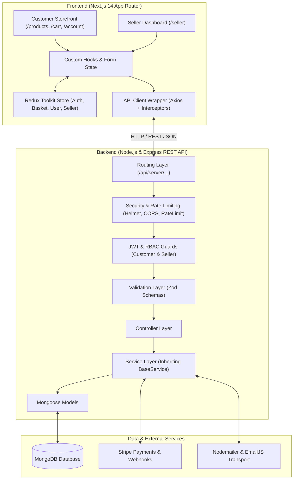

# 01. Velora — Project Overview

Velora is a production-grade, full-stack e-commerce platform built as a clean, decoupled monorepo. It features a high-performance **Next.js 14 App Router** frontend paired with a robust **Node.js / Express REST API** backend powered by **MongoDB / Mongoose**.

---

## 1. High-Level Architecture Overview

Velora enforces a strict separation between customer-facing shopping workflows and merchant-facing store management tools, bound together by a unified, secure REST API.



---

## 2. Core Accomplishments & Capabilities

- **Modular Next.js 14 Frontend**: Built using a domain-driven Feature-Folder pattern (`src/app/features/`) across 7 primary domains (`account`, `auth`, `catalog`, `home`, `order`, `product`, `seller`).
- **BaseService Repository Pattern**: Designed a centralized database abstraction (`BaseService`) providing automatic active record filtering (`isDeleted: { $ne: true }`), soft deletes, hierarchical tree reconstruction (`_buildTree`), and pagination.
- **Dual-Role RBAC (Role-Based Access Control)**: Discrete authentication mechanisms and role guards separating `Customer` and `StoreOwner` (Seller) privileges, ensuring complete data isolation.
- **Robust Payment Integration**: End-to-end Stripe payment processing using client-side Stripe Elements, server-side `PaymentIntent` lifecycle management, raw-body webhook signature verification, and automated order state transitions.
- **Centralized Schema Validation**: Comprehensive request validation powered by **Zod** across 10+ core domain models before payloads touch controller logic.
- **Resilient State Management**: Global client state orchestrating auth tokens, shopping cart, customer profiles, and store state through Redux Toolkit slices with automatic localStorage synchronization.
- **Resilient API Client**: Custom Axios HTTP wrapper with automatic Bearer token injection, silent 401 token refresh queueing, and centralized error normalization.
- **Automated Integration Testing**: Comprehensive test suite utilizing Jest, Supertest, and in-memory MongoDB (`mongodb-memory-server`) validating auth, store, product, cart, checkout, review, and webhook lifecycles.

---

## 3. Repository Directory Structure

```text
Velora/
├── Backend/                            # Node.js / Express REST API
│   ├── Server.js                       # Express bootstrap, CORS, Helmet, routes & error handling
│   ├── config/                         # Environment variables & constants
│   ├── controller/                     # HTTP controller adapters
│   ├── database/                       # MongoDB connection management
│   ├── middleware/                     # Auth guards, validation, error & rate-limiting middleware
│   ├── model/                          # Mongoose schemas & indexes (11 models)
│   ├── routes/                         # Express routing trees (versionOne)
│   ├── services/                       # Business logic & BaseService repository
│   ├── tests/                          # Jest + Supertest integration tests
│   ├── utils/                          # Logger, HTTP error factory, hash & token helpers
│   └── validation/                     # Zod request validation schemas
├── Frontend/                           # Next.js 14 App Router Application
│   ├── public/                         # Static assets, logos & banner graphics
│   └── src/
│       ├── api/                        # API client modules & Axios interceptors
│       └── app/
│           ├── account/                # Customer profile & address routes
│           ├── category/               # Category listing routes
│           ├── components/             # Reusable UI components & layouts
│           ├── features/               # Domain-specific feature modules (hooks, components, services)
│           ├── products/               # Product catalog & details routes
│           ├── redux/                  # Redux Toolkit store & slices
│           ├── seller/                 # Seller panel dashboard & store management routes
│           ├── layout.js               # Root layout & providers
│           └── page.jsx                # Landing page
├── docs/                               # Comprehensive project documentation
├── Velora.full.postman_collection.json # Complete Postman API collection
├── Velora.local.postman_environment.json # Postman local environment variables
└── ReadME.md                           # Repository summary
```

---

## 4. Key Architectural Standards

1. **Simplicity Over Complexity**: Clear, readable code paths without excessive layers or unnecessary indirection.
2. **Layered Separation of Concerns**: Routes handle endpoint mapping; Middleware enforces security and validation; Controllers handle HTTP request/response transformations; Services execute business logic; Models define data structures.
3. **Fail Fast & Explicitly**: Inputs are strictly validated against Zod schemas; invalid payloads are rejected with clear 400 Bad Request error envelopes before hitting business logic.
