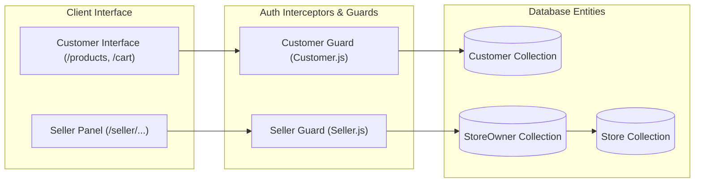
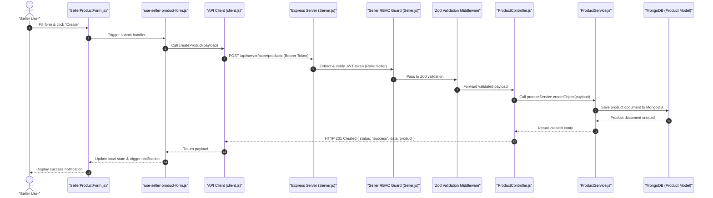

# 01.2. Architecture Roadmap & Design Decisions

This document details the architectural decisions, structural patterns, and future roadmap that define Velora's engineering strategy.

---

## 1. Core Architectural Decisions

### 1.1. Decoupled Monorepo vs Microservices
Velora uses a clean, decoupled monorepo containing `Frontend/` (Next.js) and `Backend/` (Express REST API).

- **Rationale**: Keeps repository coordination simple while maintaining strict interface isolation over standard HTTP/JSON. Both applications can be deployed independently to container platforms (e.g., Docker, Render, AWS ECS) or serverless environments (e.g., Vercel, Railway).

### 1.2. Role-Based Dual Domain Segregation
Velora enforces complete separation between Customer accounts (`Customer`) and Merchant accounts (`StoreOwner` / Seller).

- **Rationale**: Merging customer accounts and seller accounts into a single monolithic user model frequently leads to field bloat and authorization leakage. Segregating them at the model and middleware layer guarantees strict boundary enforcement.

### 1.3. Reusable BaseService Repository Pattern
All business services (`ProductService`, `StoreService`, `OrderService`, `CustomerService`, etc.) inherit from a centralized `BaseService` class.

- **Rationale**: Eliminates duplicate CRUD code, ensures uniform soft deletion (`isDeleted: true`), automatically filters out soft-deleted records from queries, standardizes pagination envelopes, and supports hierarchical recursive lookups (`_buildTree`).

### 1.4. Zod Schema-Based Validation
Request payloads are validated against centralized Zod schemas prior to invoking controller handlers.

- **Rationale**: Ensures type-safety at the runtime boundary, prevents corrupted inputs from touching the database, and returns standard, predictable HTTP 400 Bad Request error messages.

---

## 2. End-to-End Request Lifecycle

The lifecycle of an authenticated request (e.g., creating a product) illustrates the layered boundaries:

---

## 3. Engineering Roadmap

### Phase 1: Core E-Commerce & Merchant Experience (Current)
- [x] Next.js 14 App Router with responsive Tailwind CSS layout.
- [x] Customer auth, catalog browsing, search, and category tree.
- [x] Redux-managed shopping cart and slide-over basket.
- [x] Stripe checkout integration and raw-body webhook handler.
- [x] Dedicated seller panel (`/seller`) with store onboarding and product management.
- [x] BaseService query abstraction with pagination and soft deletes.
- [x] Jest and Supertest integration test suite.

### Phase 2: Enhanced Commerce & Seller Features (Upcoming)
- [ ] Multi-image product gallery with Cloudinary or S3 asset uploads.
- [ ] Product inventory variant tracking (colors, sizes, and stock-per-variant).
- [ ] Customer order cancellation and automated Stripe refund webhooks.
- [ ] Merchant analytics dashboard (sales volume, revenue graphs, top-selling items).
- [ ] Customer review moderation and seller replies.

### Phase 3: Scaling & Enterprise Architecture
- [ ] Redis caching layer for product listings and category tree lookups.
- [ ] Full-text search engine integration (Elasticsearch / Meilisearch).
- [ ] Automated CI/CD pipeline via GitHub Actions.
- [ ] Multi-region database replication and CDN edge caching.
