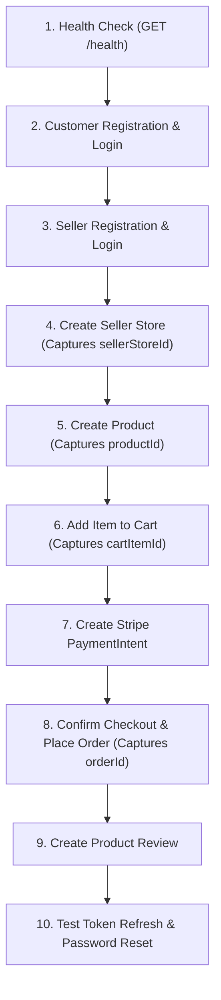

# 01.3. Postman Collection & API Testing Reference

Velora includes a complete, pre-configured Postman collection (`Velora.full.postman_collection.json`) and an active environment template (`Velora.local.postman_environment.json`) covering all backend endpoints.

---

## 1. Files in Repository

- **Collection File**: [`Velora.full.postman_collection.json`](file:///h:/Omid/Code/Velora/Velora.full.postman_collection.json)
- **Environment File**: [`Velora.local.postman_environment.json`](file:///h:/Omid/Code/Velora/Velora.local.postman_environment.json)

---

## 2. Importing into Postman

1. Open the Postman desktop application or web interface.
2. Click **Import** in the top-left corner.
3. Drag and drop both `Velora.full.postman_collection.json` and `Velora.local.postman_environment.json`.
4. In the top-right environment selector, select the newly imported **Velora Local** environment.

---

## 3. Environment Variables Reference

| Variable Key | Default Local Value | Description |
|---|---|---|
| `baseOrigin` | `http://localhost:4000` | Base origin for health endpoints |
| `baseUrl` | `http://localhost:4000/api` | Base API prefix (`/api`) |
| `customerFullName` | `Test User` | Default test customer name |
| `customerEmail` | `test@example.com` | Default test customer email |
| `customerPassword` | `password123` | Default customer password |
| `sellerName` | `Seller User` | Default test store owner name |
| `sellerEmail` | `seller@example.com` | Default store owner email |
| `sellerPassword` | `Password123!` | Default store owner password |
| `customerAccessToken` | `""` | Auto-populated on customer login |
| `customerRefreshToken` | `""` | Auto-populated on customer login |
| `sellerAccessToken` | `""` | Auto-populated on seller login |
| `sellerRefreshToken` | `""` | Auto-populated on seller login |
| `sellerStoreId` | `""` | Auto-populated on store creation |
| `productId` | `""` | Auto-populated on product creation |
| `cartItemId` | `""` | Auto-populated when adding to cart |
| `orderId` | `""` | Auto-populated when creating an order |
| `paymentMethodId` | `pm_card_visa` | Test Stripe payment method identifier |
| `webhookSignature` | `replace-me` | Stripe webhook test signature |

---

## 4. Recommended Execution Workflow

To test all endpoints smoothly from start to finish, execute requests in the following sequential order:



### Detailed Steps:

### Step 1: Health & Server Verification
- `GET {{baseOrigin}}/health` -> Expect `200 OK` (`{"status": "ok"}`)
- `GET {{baseUrl}}/server` -> Expect `200 OK` (`"server is running"`)

### Step 2: Customer Authentication Flow
- `POST {{baseUrl}}/server/customer` -> Creates customer.
- `POST {{baseUrl}}/server/customer/login` -> Logs in; Postman test script saves `customerAccessToken` and `customerRefreshToken`.
- `POST {{baseUrl}}/server/customer/token/refresh` -> Exchanges refresh token for new access token.

### Step 3: Seller Authentication Flow
- `POST {{baseUrl}}/server/store-owner` -> Creates seller account.
- `POST {{baseUrl}}/server/store-owner/login` -> Logs in; test script saves `sellerAccessToken` and `sellerRefreshToken`.

### Step 4: Store & Product Lifecycle
- `POST {{baseUrl}}/server/seller/store` -> Creates a new store; saves `sellerStoreId`.
- `POST {{baseUrl}}/server/store/products` -> Creates product under the store; saves `productId`.
- `GET {{baseUrl}}/server/product` -> Tests product search, category filtering, and pagination.

### Step 5: Commerce, Cart & Checkout
- `POST {{baseUrl}}/server/cart` -> Adds product to user cart.
- `POST {{baseUrl}}/server/checkout/payment-intent` -> Creates Stripe payment intent.
- `POST {{baseUrl}}/server/checkout` -> Finalizes checkout and creates an Order.

---

## 5. Automated Token Extraction Scripts

The Postman collection includes automatic Tests scripts that extract tokens and IDs from JSON responses:

```javascript
// Postman Tests Tab Example: Customer Login
if (pm.response.code === 200) {
    const json = pm.response.json();
    if (json.token) {
        pm.environment.set("customerAccessToken", json.token);
    }
    if (json.refreshToken) {
        pm.environment.set("customerRefreshToken", json.refreshToken);
    }
}
```

This eliminates manual copy-pasting of tokens across test runs.
