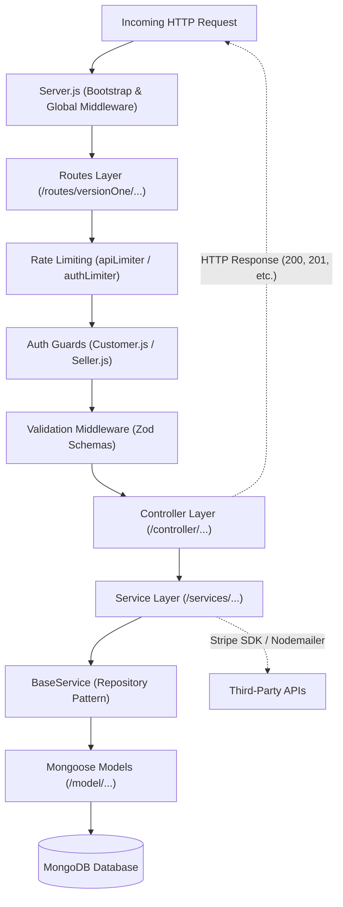

# 02. Backend Architecture

The Velora backend is built with **Node.js** and **Express.js**, using **Mongoose** to interact with **MongoDB**. It enforces a strict layered architecture to ensure separation of concerns, testability, and maintainability.

---

## 1. Architectural Layers Overview



---

## 2. Component Layer Responsibilities

### 2.1. Server & Bootstrap Layer (`Server.js`)
- Initializes Express application.
- Configures security headers with **Helmet**.
- Enforces CORS policies with dynamic origin validation.
- Configures JSON and URL-encoded body parsing with raw-body buffering for Stripe webhooks.
- Connects to MongoDB via Mongoose.
- Mounts top-level routers, 404 handler, and global error middleware.

### 2.2. Routing Layer (`routes/`)
- Pure endpoint mapping with zero business logic.
- Organizes routes by domain (`customer`, `storeOwner`, `store`, `products`, `cart`, `checkout`, `account`, `address`, `payment`, `reviews`, `webhook`).
- Assembles middleware chains: `[rateLimiter, authGuard, validationMiddleware, controllerAction]`.

### 2.3. Controller Layer (`controller/`)
- Extracts parameters, query strings, body payloads, and authenticated user tokens (`req.user`).
- Invokes corresponding service methods.
- Maps service results to standard HTTP response envelopes (`200 OK`, `201 Created`, `204 No Content`).
- Delegates unhandled errors to `next(err)`.

### 2.4. Service Layer (`services/`)
- Contains all domain business logic (e.g., password hashing, order calculations, token signing, Stripe transactions).
- Inherits from `BaseService` for database querying and persistence operations.
- Interacts with external services like Stripe and email transporters.

### 2.5. Model Layer (`model/`)
- Defines Mongoose schemas, field types, default values, and MongoDB indexes.
- Enforces data integrity at the database boundary.
- Supports soft-delete fields (`isDeleted`, `deletedAt`, `deletedBy`).

---

## 3. Directory Layout

```text
Backend/
├── Server.js                      # Application entry point
├── config/                        # Environment config loader
│   ├── env.js
│   └── constants.js
├── controller/                    # 11 Express controllers
│   ├── CustomerController.js
│   ├── StoreOwnerController.js
│   ├── StoreController.js
│   ├── ProductController.js
│   ├── CartController.js
│   ├── OrderController.js
│   ├── AccountController.js
│   ├── AddressController.js
│   ├── PaymentController.js
│   ├── ReviewController.js
│   └── WebhookController.js
├── database/                      # MongoDB connection helper
│   └── MongoDB.js
├── middleware/                    # Security, auth, validation, and error handlers
│   ├── auth/                      # JWT extraction & role guards
│   ├── error/                     # 404 & centralized error handlers
│   ├── request/                   # Rate limiting middleware
│   └── validation/                # Schema-based request validators
├── model/                         # 11 Mongoose model schemas
├── routes/                        # Versioned route definitions
│   ├── index.js
│   └── versionOne/
├── services/                      # Domain services & BaseService
│   ├── BaseService/
│   │   └── index.js
│   └── ...
├── utils/                         # Logger, httpError, and token helpers
└── validation/                    # Zod validation schema definitions
```
