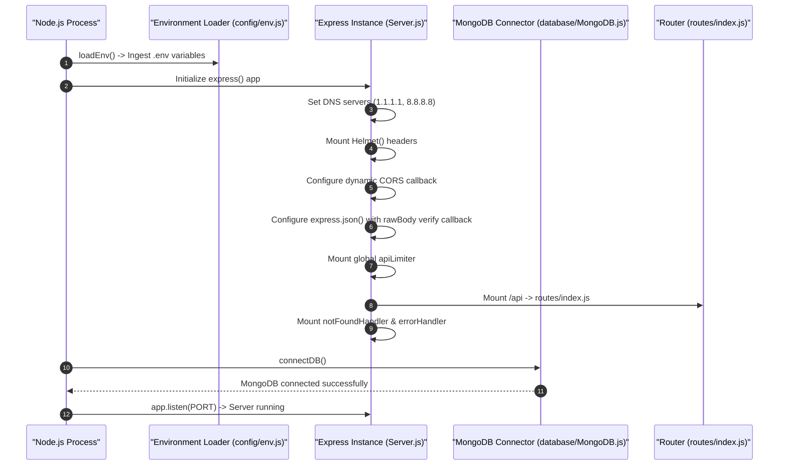

# 02.1. Server Entry & Middleware Pipeline

This document details the bootstrap process and middleware lifecycle executed inside [`Backend/Server.js`](file:///h:/Omid/Code/Velora/Backend/Server.js).

---

## 1. Application Bootstrap Lifecycle

When the server starts, it executes the following configuration sequence:



---

## 2. Security & Global Middleware

### 2.1. DNS Configuration
To ensure reliable DNS resolution across varying container and local network environments, the server sets explicit DNS resolvers:
```javascript
const dns = require('node:dns');
dns.setServers(["1.1.1.1", "8.8.8.8"]);
```

### 2.2. Helmet HTTP Headers
`app.use(helmet())` automatically applies security headers including `X-Content-Type-Options: nosniff`, `X-Frame-Options: SAMEORIGIN`, and `Strict-Transport-Security`.

### 2.3. Dynamic CORS Policy
The CORS middleware allows requests from configured `allowedOrigins` in production, and dynamically accepts any `localhost` or `127.0.0.1` port in non-production environments:
```javascript
const localhostPattern = /^https?:\/\/(localhost|127\.0\.0\.1)(:\d+)?$/i;

app.use(
  cors({
    origin: (origin, callback) => {
      if (
        !origin ||
        allowedOrigins.includes(origin) ||
        (process.env.NODE_ENV !== "production" && localhostPattern.test(origin))
      ) {
        return callback(null, true);
      }
      return callback(new Error("Not allowed by CORS"));
    },
    credentials: true,
  })
);
```

### 2.4. Raw Body Capture for Stripe Webhooks
Stripe webhook signature validation requires the exact raw byte buffer of incoming payloads. The JSON body parser intercepts and stores this in `req.rawBody` exclusively for the webhook path:
```javascript
app.use(
  express.json({
    type: "application/json",
    limit: "1mb",
    verify: (req, _res, buffer) => {
      if (/^\/api\/server\/webhook\/stripe$/i.test(req.originalUrl)) {
        req.rawBody = buffer;
      }
    },
  })
);
app.use(express.urlencoded({ extended: true }));
```

---

## 3. Rate Limiting Middleware

Rate limiting is defined in [`Backend/middleware/request/rateLimit.js`](file:///h:/Omid/Code/Velora/Backend/middleware/request/rateLimit.js) using `express-rate-limit`:

- **`apiLimiter`**: Global limiter applied to all endpoints to prevent general DDoS and scrape attacks.
- **`authLimiter`**: Strict limiter applied to authentication endpoints (`/customer/login`, `/store-owner/login`, `/customer`, `/store-owner`, etc.) to prevent brute-force attacks.

---

## 4. Error Handling Pipeline

All errors flow through a standardized error-handling sequence:

### 4.1. 404 Not Found Handler (`middleware/error/notFound.js`)
Intercepts any request that does not match a registered route and forwards a 404 HTTP Error to the error handler:
```javascript
const { createHttpError } = require("../../utils/httpError");

function notFoundHandler(req, _res, next) {
  next(createHttpError(404, `Route ${req.originalUrl} not found`));
}
```

### 4.2. Centralized Error Handler (`middleware/error/errorHandler.js`)
Formats error responses uniformly into JSON envelopes:
```javascript
function errorHandler(err, _req, res, _next) {
  const statusCode = err.status || err.statusCode || 500;
  const message = err.message || "Internal Server Error";

  logger.error(`${statusCode} - ${message}`);

  return res.status(statusCode).json({
    status: "error",
    statusCode,
    message,
    ...(process.env.NODE_ENV === "development" && { stack: err.stack }),
  });
}
```
