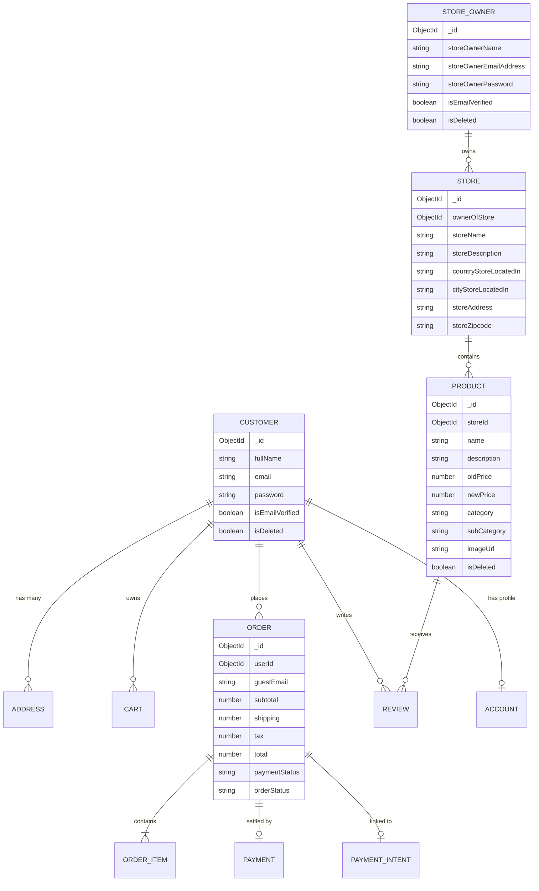

# 02.3. Data Models & Mongoose Schemas

Velora defines **11 Mongoose domain models** located in [`Backend/model/`](file:///h:/Omid/Code/Velora/Backend/model/). All schemas include timestamps (`createdAt`, `updatedAt`) and disable Mongoose internal versioning (`versionKey: false`).

---

## 1. Entity Relationship Diagram

---

## 2. Comprehensive Model Schemas

### 2.1. Customer (`Customer.js`)
Represents customer storefront accounts.
- `fullName` *(String, required, trim)*
- `email` *(String, required, unique, trim, lowercase, index)*
- `password` *(String, required, bcrypt hash)*
- `isEmailVerified` *(Boolean, default: false)*
- `emailVerificationToken` *(String, default: null)*
- `passwordResetToken` *(String, default: null)*
- `isDeleted` *(Boolean, default: false, index)*
- `deletedAt` *(Date, default: null)*

### 2.2. StoreOwner (`storeOwner.js`)
Represents merchant seller accounts with access to the Seller Panel.
- `storeOwnerName` *(String, required, trim)*
- `storeOwnerEmailAddress` *(String, required, unique, trim, lowercase, index)*
- `storeOwnerPassword` *(String, required, bcrypt hash)*
- `isEmailVerified` *(Boolean, default: false)*
- `emailVerificationToken` *(String, default: null)*
- `passwordResetToken` *(String, default: null)*
- `isDeleted` *(Boolean, default: false, index)*
- `deletedAt` *(Date, default: null)*

### 2.3. Store (`Store.js`)
Represents a seller's registered storefront.
- `ownerOfStore` *(ObjectId -> `Seller`, required, index)*
- `storeName` *(String, required, index)*
- `storeDescription` *(String, required, index)*
- `countryStoreLocatedIn` *(String, required, index)*
- `stateOrProvinceStoreLocatedIn` *(String, optional, index)*
- `cityStoreLocatedIn` *(String, required, index)*
- `storeAddress` *(String, required, index)*
- `storeZipcode` *(String, required, index)*

### 2.4. Product (`Product.js`)
Represents catalog items listed for sale.
- `storeId` *(ObjectId -> `Store`, required, index)*
- `name` *(String, required, trim)*
- `description` *(String, required, trim)*
- `price` *(Number, min: 0)*
- `oldPrice` *(Number, required, min: 0)*
- `newPrice` *(Number, min: 0)*
- `discount` *(String, trim)*
- `category` *(String, required, trim, index)*
- `subCategory` *(String, required, trim, index)*
- `imageUrl` *(String, required, trim)*
- `image` *(String, trim)*
- `NewArrivals` *(Boolean, default: false, index)*
- `color` *(Array of Strings)*
- `size` *(Array of Strings)*
- `highlights` *(Array of Strings)*
- `details` *(String, trim)*
- `isDeleted` *(Boolean, default: false, index)*
- `deletedBy` *(ObjectId -> `Seller`, default: null, index)*
- `deletedAt` *(Date, default: null)*

### 2.5. Cart (`Cart.js`)
Persists active shopping cart items for authenticated customers or guest sessions.
- `userId` *(ObjectId -> `User`, index, default: null)*
- `guestSessionId` *(String, index, default: null)*
- `items` *(Array of CartItem: `productId`, `name`, `image`, `selectedColor`, `selectedSize`, `quantity`, `oldPrice`, `newPrice`, `discount`)*
- `subtotal` *(Number, default: 0)*
- `tax` *(Number, default: 0)*
- `shipping` *(Number, default: 0)*
- `total` *(Number, default: 0)*

### 2.6. Order (`Order.js`)
Represents placed orders, item snapshots, financial calculations, and fulfillment status.
- `userId` *(ObjectId -> `User`, default: null, index)*
- `guestEmail` *(String, trim, lowercase, default: null, index)*
- `items` *(Array of OrderItem snapshots)*
- `subtotal` *(Number, required, min: 0)*
- `shipping` *(Number, required, default: 0)*
- `tax` *(Number, required, default: 0)*
- `total` *(Number, required, min: 0)*
- `currency` *(String, default: "USD")*
- `addressSnapshot` *(Object: `street`, `country`, `city`, `postalCode`)*
- `paymentStatus` *(Enum: `"pending"`, `"requires_action"`, `"paid"`, `"failed"`, `"refunded"`, default: `"pending"`, index)*
- `orderStatus` *(Enum: `"pending"`, `"processing"`, `"shipped"`, `"delivered"`, `"cancelled"`, default: `"pending"`, index)*

### 2.7. Payment & PaymentIntent (`Payment.js` & `PaymentIntent.js`)
Tracks Stripe payment intent references and processed transactions.
- `PaymentIntent`: `paymentIntentId`, `clientSecret`, `amount`, `currency`, `status`, `userId`, `cartId`
- `Payment`: `orderId`, `stripePaymentIntentId`, `amount`, `currency`, `paymentMethod`, `status`

### 2.8. Review (`Review.js`)
Customer product ratings and testimonials.
- `productId` *(ObjectId -> `Product`, required, index)*
- `userId` *(ObjectId -> `User`, required, index)*
- `authorName` *(String, required, trim)*
- `rating` *(Number, required, min: 1, max: 5)*
- `comment` *(String, required, trim)*

### 2.9. Address & Account (`Address.js` & `Account.js`)
- `Address`: `userId`, `street`, `city`, `state`, `postalCode`, `country`, `isDefault`
- `Account`: `userId`, `phoneNumber`, `dateOfBirth`, `preferredLanguage`, `newsletterSubscribed`
