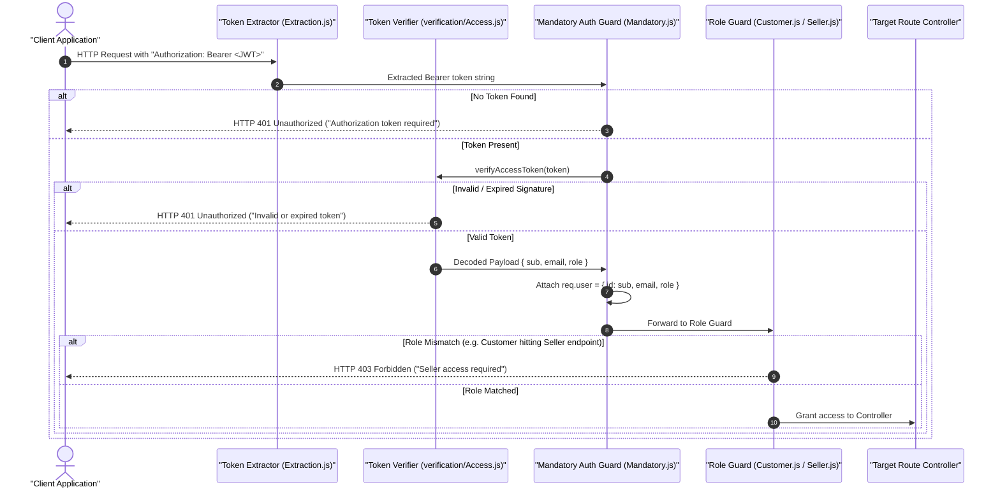

# 02.4. Authentication & RBAC Middleware

Velora enforces a secure, stateless **Role-Based Access Control (RBAC)** architecture using JSON Web Tokens (JWT). The authentication pipeline is located in [`Backend/middleware/auth/`](file:///h:/Omid/Code/Velora/Backend/middleware/auth/).

---

## 1. Authentication & Token Architecture



---

## 2. Pipeline Components

### 2.1. Token Extraction (`middleware/auth/token/Extraction.js`)
Extracts the raw bearer token from the standard `Authorization` request header:
```javascript
function extractToken(req) {
  const authHeader = req.headers.authorization || req.headers.Authorization;
  if (!authHeader || !authHeader.startsWith("Bearer ")) {
    return null;
  }
  return authHeader.split(" ")[1];
}
```

### 2.2. Mandatory Authentication Guard (`middleware/auth/token/authorization/Mandatory.js`)
Validates the token signature and expiration, unpacking identity metadata into `req.user`:
```javascript
function requireAuth(req, _res, next) {
  const token = extractToken(req);
  if (!token) {
    return next(createHttpError(401, "Authorization token required"));
  }

  try {
    const payload = verifyAccessToken(token);
    req.user = {
      id: payload.sub,
      email: payload.email,
      role: payload.role,
    };
    return next();
  } catch (_error) {
    return next(createHttpError(401, "Invalid or expired token"));
  }
}
```

### 2.3. Role-Based Access Guards (`middleware/auth/system/`)
- **`requireCustomer`** (`Customer.js`): Ensures `req.user.role === "customer"`. Returns `403 Forbidden` if a seller or unauthenticated caller attempts to access customer endpoints.
- **`requireSeller`** (`Seller.js`): Ensures `req.user.role === "seller"`. Protects store onboarding, store configuration, and seller-scoped product mutations.

---

## 3. JWT Token Payload Structure

### Access Token Payload
```json
{
  "sub": "664b3c10a12e8b2f90a4d5e1",
  "email": "seller@example.com",
  "role": "seller",
  "iat": 1716200000,
  "exp": 1716286400
}
```

### Dual-Token Strategy
1. **Access Token**: Short-lived (e.g., 1 day), sent in `Authorization: Bearer <token>` headers on every API call.
2. **Refresh Token**: Long-lived (e.g., 7 days), securely stored in browser storage and exchanged via `/customer/token/refresh` or `/store-owner/token/refresh` when access tokens expire.
