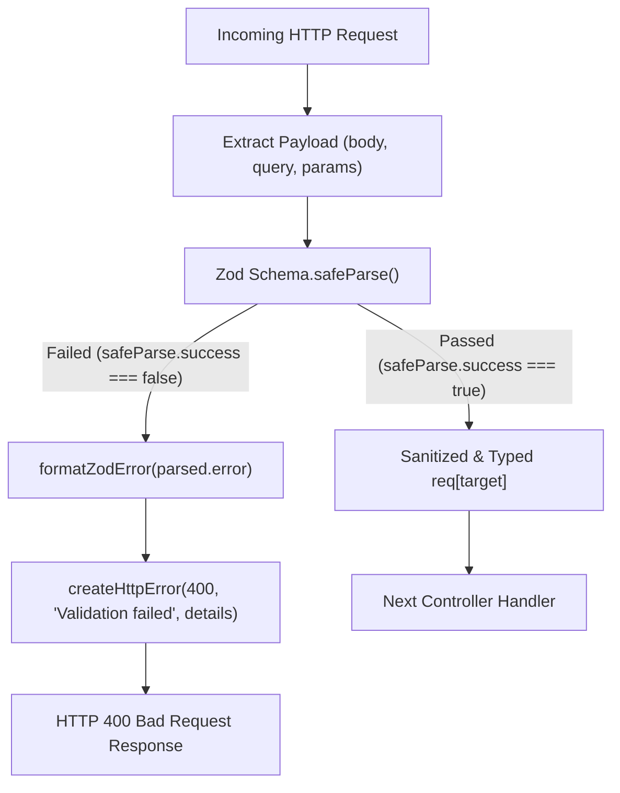

# 02.5. Centralized Validation Layer

Velora employs a declarative validation architecture powered by **Zod**. Schemas are located in [`Backend/validation/`](file:///h:/Omid/Code/Velora/Backend/validation/) and wired into routes via [`Backend/middleware/validation/`](file:///h:/Omid/Code/Velora/Backend/middleware/validation/).

---

## 1. Validation Architecture & Flow



---

## 2. Validator Factory (`middleware/validation/common.js`)

The `createValidator` higher-order function encapsulates payload parsing and standardizes error responses:

```javascript
function formatZodError(error) {
  return error.errors.map((issue) => ({
    path: issue.path.join("."),
    message: issue.message,
  }));
}

function createValidator(target, schema) {
  return function validateRequest(req, _res, next) {
    const parsed = schema.safeParse(req[target]);

    if (!parsed.success) {
      return next(
        createHttpError(400, "Validation failed", formatZodError(parsed.error))
      );
    }

    req[target] = parsed.data;
    return next();
  };
}

const validateBody = (schema) => createValidator("body", schema);
const validateQuery = (schema) => createValidator("query", schema);
const validateParams = (schema) => createValidator("params", schema);
```

---

## 3. Schema Definitions

### 3.1. General & Reusable Schemas (`validation/general/`)
- **`objectId`**: Ensures strings conform to valid MongoDB 24-character hexadecimal ObjectIds:
  ```javascript
  const objectId = z.string().refine((val) => mongoose.Types.ObjectId.isValid(val), {
    message: "Invalid ObjectId",
  });
  ```
- **`objectIdParamsSchema`**: Validates route parameters containing `:id`.
- **`tokenOnlySchema`**: Validates email/password token payloads.

### 3.2. Product Validation (`validation/product/productValidation.js`)
Validates product creation, category assignments, and pricing structures:
```javascript
const createProductSchema = z.object({
  storeId: objectId,
  name: z.string().min(2).max(120),
  description: z.string().min(10),
  price: z.number().min(0).optional(),
  oldPrice: z.number().min(0),
  newPrice: z.number().min(0).optional(),
  discount: z.string().optional(),
  category: z.string().min(2),
  subCategory: z.string().min(2),
  imageUrl: z.string().url(),
  image: z.string().optional(),
  NewArrivals: z.boolean().optional(),
  color: z.array(z.string()).optional(),
  size: z.array(z.string()).optional(),
  highlights: z.array(z.string()).optional(),
  details: z.string().optional(),
});
```

### 3.3. Store Validation (`validation/store/StoreValidation.js`)
Validates merchant store onboarding fields (store name, description, address, zipcode).

---

## 4. Standardized Validation Error Response

When a validation constraint is violated, the API returns a structured HTTP 400 response:

```json
{
  "status": "error",
  "statusCode": 400,
  "message": "Validation failed",
  "details": [
    {
      "path": "email",
      "message": "Invalid email address"
    },
    {
      "path": "password",
      "message": "String must contain at least 8 character(s)"
    }
  ]
}
```
