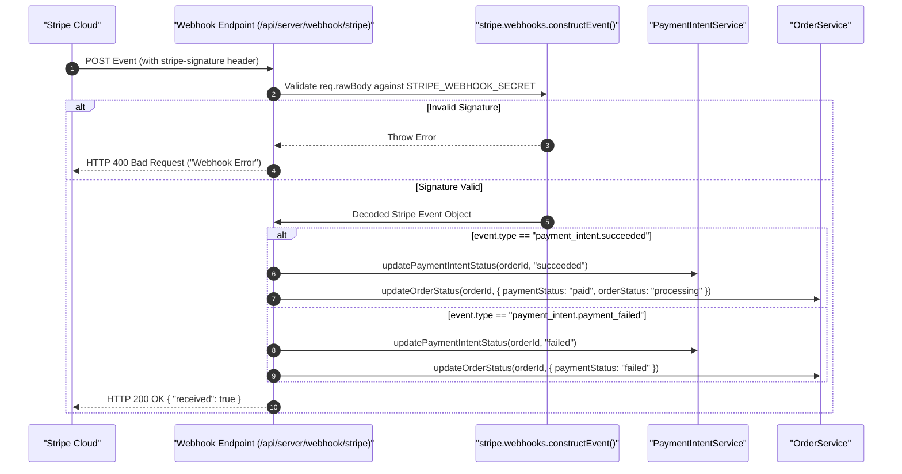

# 03.5. Reviews, Account, Address & Webhook API Reference

This document covers secondary domain APIs supporting customer experience and asynchronous Stripe webhook events.

---

## 1. Reviews API

Base Path: `/api/server/review` (or `/api/server/reviews`)

### 1.1. Get Product Reviews
- **Method**: `GET`
- **Path**: `/api/server/reviews/:productId`
- **Auth**: None (Public)
- **Response**: `200 OK`
  ```json
  {
    "data": [
      {
        "_id": "664b3cd0a12e8b2f90a4d615",
        "productId": "664b3c90a12e8b2f90a4d5f1",
        "userId": "664b3c10a12e8b2f90a4d5e1",
        "authorName": "Jane Doe",
        "rating": 5,
        "comment": "Exceptional quality! Exactly as described.",
        "createdAt": "2026-05-20T14:30:00.000Z"
      }
    ]
  }
  ```

### 1.2. Submit Product Review
- **Method**: `POST`
- **Path**: `/api/server/reviews/:productId`
- **Auth Guard**: `requireCustomer`
- **Request Body**:
  ```json
  {
    "authorName": "Jane Doe",
    "rating": 5,
    "comment": "Exceptional quality! Exactly as described."
  }
  ```
- **Response**: `201 Created`

---

## 2. Customer Account & Address Book APIs

### 2.1. Account Profile
- **Get Profile**: `GET /api/server/customer/login/account` (`requireCustomer`) -> `200 OK`
- **Update Profile**: `POST /api/server/customer/login/account` (`requireCustomer`) -> `200 OK`

### 2.2. Address Book
- **List Addresses**: `GET /api/server/customer/login/account/address` (`requireCustomer`) -> `200 OK`
- **Create Address**: `POST /api/server/customer/login/account/address` (`requireCustomer`)
  ```json
  {
    "street": "100 Pine Street",
    "city": "San Francisco",
    "state": "California",
    "postalCode": "94111",
    "country": "United States",
    "isDefault": true
  }
  ```
- **Response**: `201 Created`

---

## 3. Stripe Webhook Endpoint

### 3.1. Stripe Event Handler
- **Method**: `POST`
- **Path**: `/api/server/webhook/stripe`
- **Auth**: Signature Verification via `stripe-signature` header & `STRIPE_WEBHOOK_SECRET`
- **Payload Handling**: Relies on unparsed `req.rawBody` buffer captured in `Server.js`.


