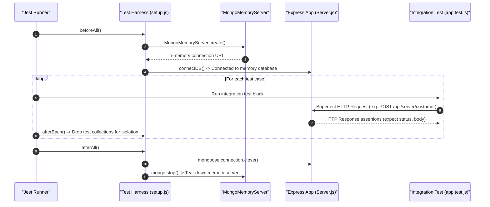

# 03.6. Integration Testing Suite & Jest Architecture

Velora features an automated end-to-end integration test suite located in [`Backend/tests/`](file:///h:/Omid/Code/Velora/Backend/tests/) powered by **Jest**, **Supertest**, and **mongodb-memory-server**.

---

## 1. Test Architecture & Lifecycle

The testing suite does not require an external running MongoDB instance. It spins up an ephemeral in-memory MongoDB instance per test run:



---

## 2. Test File Inventory

- **`Backend/tests/setup.js`**: Global test environment initializer configuring test secrets, lifecycle hooks (`beforeAll`, `afterEach`, `afterAll`), and in-memory database connections.
- **`Backend/tests/app.test.js`**: 530+ lines of comprehensive integration tests validating:
  - Customer registration, login, token refresh, and email verification.
  - Seller registration, login, and authorization boundaries.
  - Store creation, store update, and soft delete.
  - Product catalog creation, filtering, and pagination.
  - Shopping cart operations (add, update, delete, clear).
  - Stripe PaymentIntent generation and order checkout finalization.
  - Product review creation and fetching.
- **`Backend/tests/mailer.test.js`**: Verifies transactional email triggers and template parameter rendering without sending actual live emails.

---

## 3. Running the Test Suite

Execute the test suite in-band:

```bash
cd Backend
npm test
```

Run tests in watch mode during development:

```bash
npm run test:watch
```

Run tests with test database skipped (for unit-only verification):

```bash
SKIP_TEST_DB=true npm test
```
