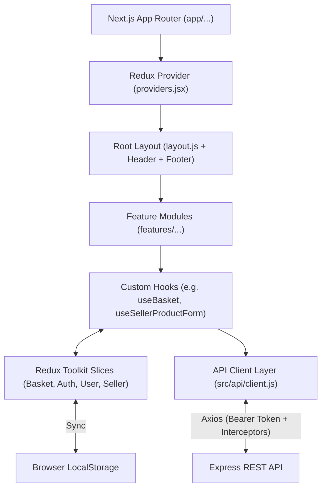

# 04. Frontend Architecture

The Velora frontend is engineered using **Next.js 14** with the **App Router**, **React 18**, **Tailwind CSS**, and **Redux Toolkit**.

---

## 1. Architectural Principles & Patterns

1. **Feature-Folder Domain Separation**: Components, state hooks, and API adapters are grouped under domain directories in `src/app/features/`.
2. **Decoupled API Client Layer**: All network calls flow through a unified Axios instance with request and response interceptors (`src/api/client.js`).
3. **Hybrid SSR / Client Rendering**: Server components handle SEO metadata, OpenGraph generation, and static landing shells; Client components (`"use client"`) manage interactive states (cart drawer, checkout modals, seller form controls).
4. **Resilient Client State**: Global client state (Auth, Basket, User Profile, Seller Profile) is managed via Redux Toolkit and automatically synced with browser storage.

---

## 2. Directory Anatomy

```text
Frontend/
├── public/                         # Static icons, logos, banners
└── src/
    ├── api/                        # HTTP Client & Domain Endpoints
    │   ├── client.js               # Centralized Axios client + interceptors
    │   ├── auth/                   # Customer & seller auth API methods
    │   ├── product/                # Product querying & mutation methods
    │   ├── Store/                  # Store management methods
    │   ├── customer/               # Account & address methods
    │   └── order/                  # Cart & checkout methods
    └── app/
        ├── layout.js               # Root layout, Geist fonts & SEO metadata
        ├── providers.jsx           # Redux Provider wrapper
        ├── page.jsx                # Landing storefront page
        ├── globals.css             # Tailwind base styles
        ├── components/             # Shared UI components (header, footer, banners)
        ├── features/               # Domain-driven feature packages
        │   ├── account/            # Account profile & address components
        │   ├── auth/               # Auth modals, forms & login hooks
        │   ├── catalog/            # Catalog browsing, filtering & search
        │   ├── home/               # Landing hero & featured sections
        │   ├── order/              # Basket drawer, checkout & Stripe forms
        │   ├── product/            # Product details & review cards
        │   └── seller/             # Seller dashboard, store & product forms
        ├── redux/                  # Redux Toolkit store & slices
        │   ├── store/index.js      # configureStore setup
        │   └── slice/              # Basket, Auth, User, StoreOwner slices
        ├── seller/                 # Seller panel App Router pages
        ├── products/               # Product catalog App Router pages
        └── account/                # Customer profile App Router pages
```

---

## 3. Component & State Interaction Map


