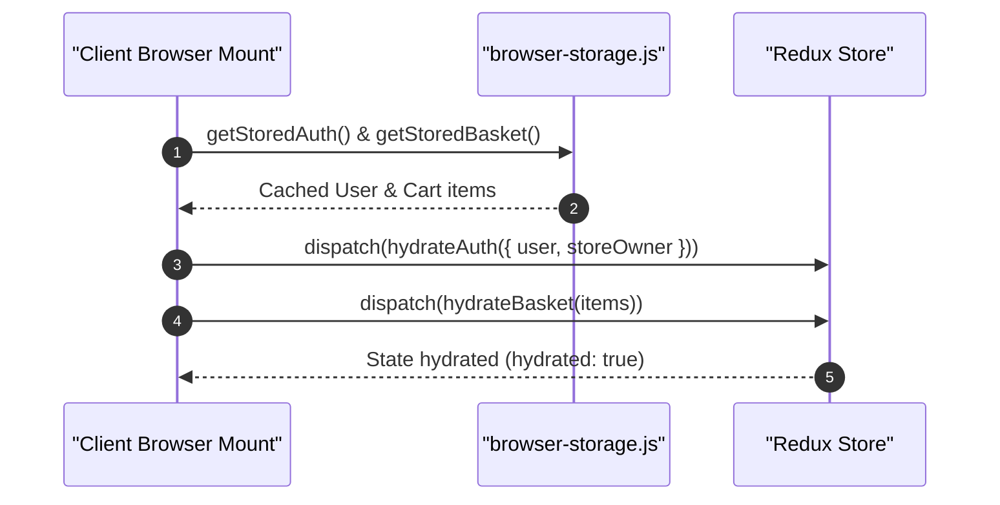

# 04.1. Redux Toolkit State Management

Velora uses **Redux Toolkit** to manage centralized client state. The store is configured in [`Frontend/src/app/redux/store/index.js`](file:///h:/Omid/Code/Velora/Frontend/src/app/redux/store/index.js) and includes 4 dedicated slices.

---

## 1. Redux Slices Inventory

### 1.1. `authSlice` (`slice/authSlice.js`)
Controls authentication state and global modal visibility:
- `user`: Authenticated customer profile object or `null`.
- `storeOwner`: Authenticated seller profile object or `null`.
- `hydrated`: Boolean tracking whether initial browser storage hydration has completed.
- `loginPopupOpen`: Controls customer sign-in / sign-up modal visibility.
- `sellerPopupOpen`: Controls seller sign-in / store registration modal visibility.

### 1.2. `basketSlice` (`slice/BasketSlice.js`)
Controls customer shopping basket items and cart state:
- `addItem`: Adds an item or increments quantity if matching `(id, selectedColor, selectedSize)`.
- `updateQuantity`: Adjusts item quantity.
- `removeItem`: Filters out specific variant combination.
- `clearBasket`: Empties the cart.
- Automatically persists updates to browser localStorage via `saveStoredBasket()`.

### 1.3. `userSlice` (`slice/UserSlice.js`)
Manages detailed customer metadata, default delivery address, and account preferences.

### 1.4. `storeOwnerSlice` (`slice/StoreOwnerSlice.js`)
Manages merchant store metadata, active store ID, and seller profile settings.

---

## 2. Store Hydration Pattern

On client component mounting, the app loads cached tokens and cart items from browser storage into Redux:

