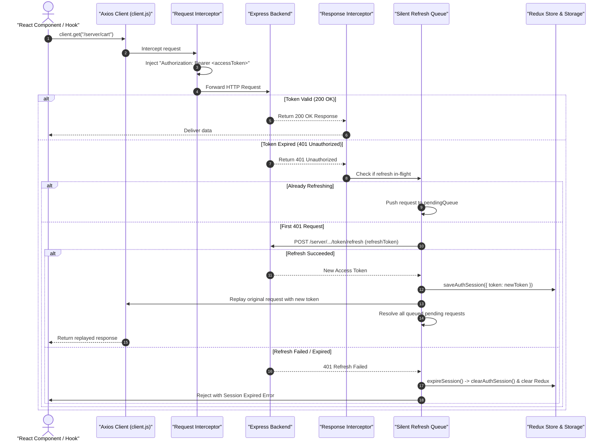

# 04.2. API Client Layer & Axios Interceptors

Velora routes all frontend HTTP requests through a unified, resilient Axios client located in [`Frontend/src/api/client.js`](file:///h:/Omid/Code/Velora/Frontend/src/api/client.js).

---

## 1. Interceptor Architecture & Lifecycle



---

## 2. Implementation Highlights

### 2.1. Request Interceptor: Token Injection
```javascript
client.interceptors.request.use((config) => {
  const token = getAccessToken();
  if (token) {
    config.headers.Authorization = `Bearer ${token}`;
  }
  return config;
});
```

### 2.2. Dynamic Role Refresh Endpoint Resolution
The client dynamically chooses the appropriate refresh route based on active Redux auth state:
```javascript
function getRefreshEndpoint() {
  const authState = store.getState()?.auth;
  if (authState?.storeOwner) {
    return "/server/store-owner/token/refresh";
  }
  return "/server/customer/token/refresh";
}
```

### 2.3. Pending Request Queue
When multiple parallel requests fail simultaneously due to an expired access token, only **one** refresh request is dispatched to the backend. All other requests are queued in `pendingQueue` and replayed automatically once the new token is acquired.

### 2.4. Session Expiration & Cleanup
When refresh fails (e.g., refresh token expired), `expireSession()` clears credentials and resets Redux state:
```javascript
function expireSession() {
  clearAuthSession();
  store.dispatch(clearAuth());
  store.dispatch(clearUserProfile());
  store.dispatch(clearStoreOwnerProfile());
}
```
