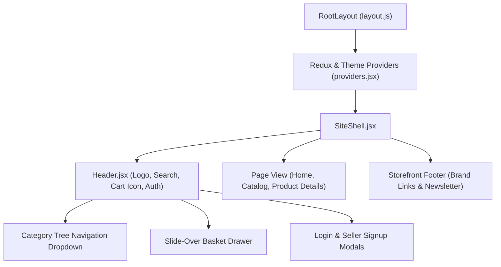

# 04.3. Layout, Navigation & SEO Shell

Velora's storefront shell is built with modern responsive navigation, accessible dropdowns, dynamic category trees, and search engine optimization (SEO) configurations.

---

## 1. Storefront Shell & Navigation

The primary storefront layout is provided by [`SiteShell.jsx`](file:///h:/Omid/Code/Velora/Frontend/src/app/components/layout/SiteShell.jsx) wrapping [`Header.jsx`](file:///h:/Omid/Code/Velora/Frontend/src/app/components/layout/header/Header.jsx).

---

## 2. Header & Navigation Capabilities

- **Brand & Logo**: Fixed top navbar with branded luxury typography and theme accents.
- **Dynamic Category Flyouts**: Interactive category and sub-category menus dynamically grouping items by department (e.g. Clothing, Accessories, Watches).
- **Search Bar**: Real-time query search directing users to `/products?search=...`.
- **Basket Trigger & Badge**: Displays live item count from `BasketSlice` with click-to-open slide-over cart drawer.
- **Account Dropdown / Login Triggers**: Contextual action buttons adjusting based on customer vs seller session state.

---

## 3. SEO & Structured Metadata

Velora implements best practices for search engine discoverability and social sharing:

### 3.1. App Router Metadata (`layout.js`)
Configures canonical URLs, application titles, descriptions, theme colors, and favicon icons.

### 3.2. Dynamic OpenGraph & Twitter Cards
- **`opengraph-image.js`**: Generates high-resolution 1200x630 branded preview cards dynamically.
- **`twitter-image.js`**: Generates `summary_large_image` cards for social networks.

### 3.3. JSON-LD Structured Data
Embeds schema.org `Organization` and `WebSite` JSON-LD schemas via `JsonLd.jsx` to maximize rich search snippets.

### 3.4. Crawling Directives
- **`robots.js`**: Configures search bot indexing rules and references `/sitemap.xml`.
- **`sitemap.js`**: Automatically builds dynamic sitemap entries across core pages and product paths.
