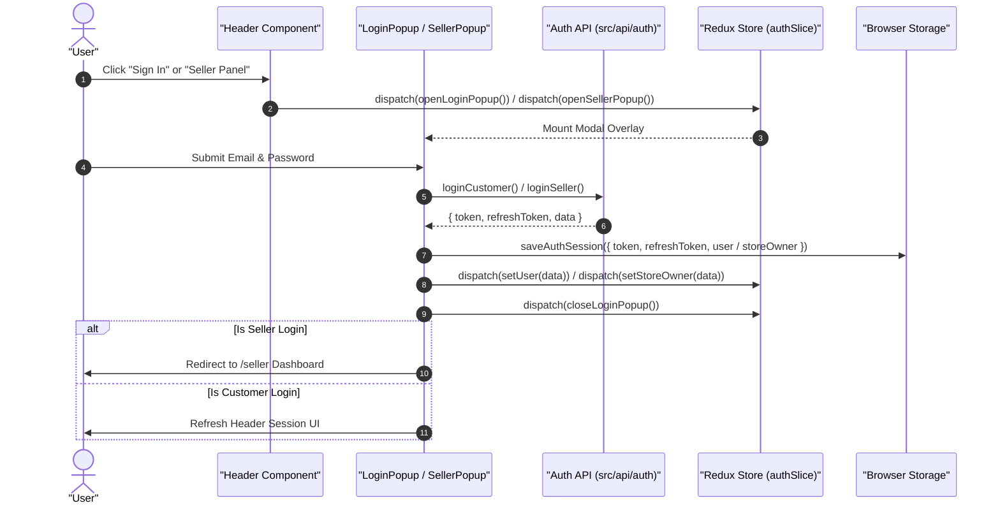

# 04.4. Frontend Authentication Flows

Velora manages dual-role authentication using modal overlays, Redux state synchronization, and browser storage persistence.

---

## 1. Authentication Modals & Components

The authentication UI is modularized in [`Frontend/src/app/features/auth/components/`](file:///h:/Omid/Code/Velora/Frontend/src/app/features/auth/components/):

- **`LoginPopup.jsx`**: Customer sign-in modal with email/password inputs, Google SSO placeholder, and toggle links for signup/reset.
- **`SignupPopup.jsx`**: Customer account creation modal with real-time validation and automatic email verification prompts.
- **`LogIntoSellerPanelPopup.jsx`**: Dedicated merchant sign-in modal directing authenticated sellers to `/seller`.
- **`SellerSignupPopup.jsx`**: Merchant onboarding modal collecting seller credentials and store details.
- **`ResetPasswordPopup.jsx`**: Two-step password recovery flow (request reset code -> input token & new password).
- **`EmailVerificationPopup.jsx`**: 6-digit confirmation code verification modal.

---

## 2. Customer vs Seller Authentication Flow

---

## 3. Session Persistence & Route Protection

1. **Storage Utility (`browser-storage.js`)**: Encapsulates reading and writing tokens and user session payloads to `localStorage`.
2. **Page Guarding (`useSellerGuard` / `useCustomerGuard`)**: Custom hooks that inspect `auth.storeOwner` or `auth.user` on protected routes (like `/seller` or `/account`), redirecting unauthenticated users to home or triggering the appropriate login modal.
