# 05. Customer Features Overview

Velora provides a seamless customer journey spanning catalog exploration, variant selection, basket management, secure Stripe checkout, and account profile management.

---

## 1. End-to-End Customer Journey

```mermaid
graph LR
    Home["1. Landing Page (Hero Banners & Curations)"] --> Catalog["2. Product Catalog (Search & Category Filters)"]
    Catalog --> Details["3. Product Details (Colors, Sizes & Reviews)"]
    Details --> Basket["4. Basket Slide-Over Drawer"]
    Basket --> Checkout["5. Checkout & Stripe Elements"]
    Checkout --> Confirmation["6. Order Placed & Confirmation Email"]
    Confirmation --> Account["7. Account History & Address Book"]
```

---

## 2. Customer Domain Directory

- [05.1. Home Page Experience](05.1-home-page.md) — Hero promotional carousel, featured product grid, and category discovery.
- [05.2. Product Catalog & Search](05.2-product-catalog-search.md) — Catalog browsing, multi-faceted filtering (price, category), search, and product detail view.
- [05.3. Cart, Checkout & Payment Flow](05.3-cart-checkout-order-flow.md) — Slide-over basket drawer, checkout steps, Stripe Elements payment processing, and order confirmation.
- [05.4. Customer Account & Orders](05.4-customer-account.md) — Customer profile management, address book CRUD, and order history tracking.
