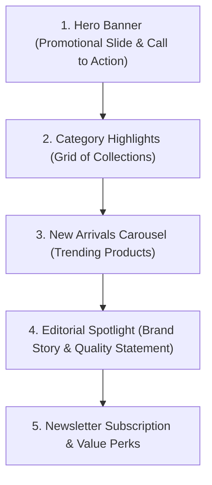

# 05.1. Home Page Experience

The landing page located at [`Frontend/src/app/page.jsx`](file:///h:/Omid/Code/Velora/Frontend/src/app/page.jsx) serves as the primary gateway to the Velora storefront.

---

## 1. Structure & Visual Sections

The home view is assembled via [`HomePage.jsx`](file:///h:/Omid/Code/Velora/Frontend/src/app/features/home/HomePage.jsx):

---

## 2. Key Components

- **Hero Slider**: Dynamic promotional banners highlighting seasonal collections with primary action buttons linking directly into catalog filters.
- **Curated Category Cards**: Visual shortcuts to top categories (`Women`, `Men`, `Watches`, `Accessories`) with custom photography and hover transitions.
- **New Arrivals Showcase**: Interactive horizontal product cards displaying live product prices, badges (`NewArrivals: true`), and instant "Add to Cart" triggers.
- **Value Propositions**: Informational trust badges (e.g. "Free Global Shipping", "Ethical Craftsmanship", "Secure Stripe Checkout", "30-Day Easy Returns").
