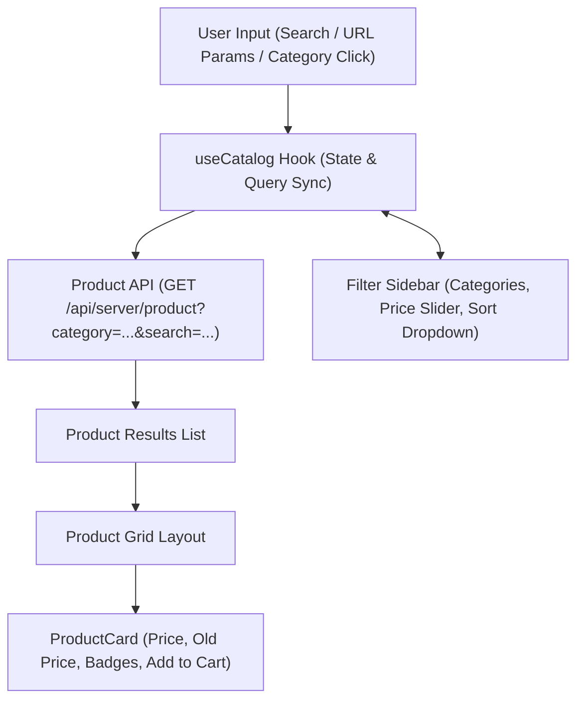

# 05.2. Product Catalog, Filtering & Search

The catalog engine is driven by [`CatalogPage.jsx`](file:///h:/Omid/Code/Velora/Frontend/src/app/features/catalog/CatalogPage.jsx) and the product route `/products`.

---

## 1. Catalog Layout & State Flow

---

## 2. Catalog Features

### 2.1. Multi-Faceted Filtering
- **Category Tree Selection**: Filter items by root category or sub-category.
- **Price Range Bounds**: Filter products within defined minimum and maximum price points.
- **Sort Ordering**: Sort by Price (Low to High / High to Low), Newest Arrivals, or Name.

### 2.2. Real-Time Search
The header search bar binds to the URL query string (`?search=term`), automatically filtering product titles and descriptions.

### 2.3. Product Detail View (`/products/[id]`)
- **Image Gallery**: High-resolution product images.
- **Variant Selector**: Interactive color chips and size buttons updating the active selection.
- **Stock & Pricing**: Displays discounted price with old price strikethrough and discount percentage badge.
- **Review List & Rating Form**: Displays verified customer ratings and star score breakdowns.
