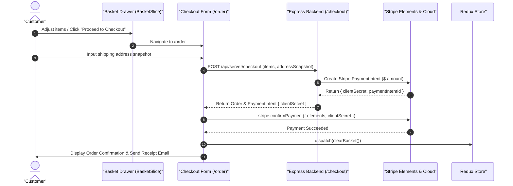

# 05.3. Cart, Checkout & Stripe Payment Flow

Velora coordinates a full-featured e-commerce checkout flow powered by **Redux Toolkit** on the client and **Stripe Elements / PaymentIntents** on the backend.

---

## 1. Checkout Workflow Sequence

---

## 2. Component Breakdown

### 2.1. Slide-Over Basket Drawer
- Shows line items with active variant details (chosen color, size, unit price, quantity).
- Supports instant inline quantity increments, decrements, and removals.
- Calculates subtotal and estimated shipping in real-time.

### 2.2. Address Snapshot Capture
During checkout, customer address fields (street, city, state, postal code, country) are captured as an immutable `addressSnapshot` embedded directly in the `Order` document, ensuring historical orders remain accurate even if user profiles change later.

### 2.3. Stripe Elements Payment Form
- Embeds official Stripe card input fields with real-time validation and localized payment error messages.
- Communicates directly with Stripe Cloud via `clientSecret` generated by `/api/server/checkout`.
