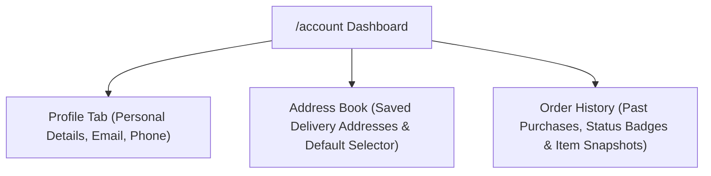

# 05.4. Customer Account & Address Management

The Customer Account portal located at `/account` allows shoppers to manage their profile information, saved delivery addresses, and past order history.

---

## 1. Account Portal Overview

---

## 2. Feature Details

### 2.1. Profile Management
- View and update full name, contact phone number, and communication preferences.
- Security actions: Update password and request email verification re-sends.

### 2.2. Address Book CRUD
- Add new delivery addresses with full street, city, state, and postal code attributes.
- Designate primary / default shipping destination for streamlined one-click checkout.
- Delete or modify obsolete shipping addresses.

### 2.3. Order History & Status Tracking
- Lists all past orders placed under the customer's account.
- Displays order timestamps, total spend, fulfillment status badge (`pending`, `processing`, `shipped`, `delivered`), and payment status (`paid`, `pending`).
- Expandable line-item breakdown with item snapshots, purchased quantities, and product imagery.
