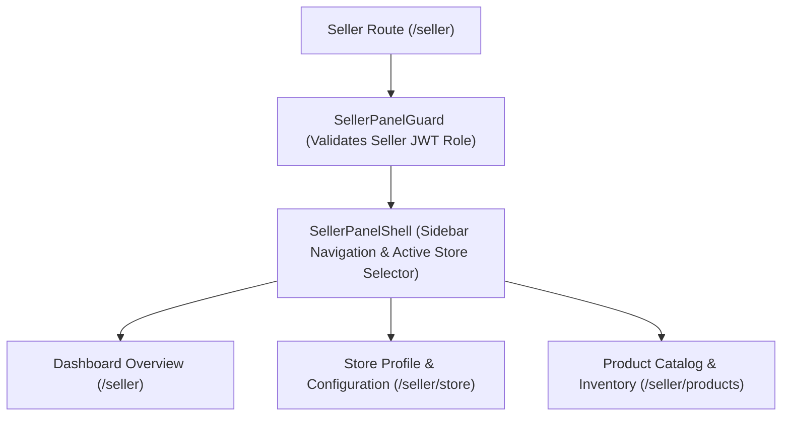

# 06. Seller Panel Overview

The **Seller Panel** at `/seller` provides merchants with a dedicated back-office environment for managing stores, product inventories, and catalog listings.

---

## 1. Merchant Platform Architecture

---

## 2. Seller Panel Sections

- [06.1. Seller Panel Shell & Layout](06.1-seller-panel-shell.md) — Shell architecture, navigation sidebar, and store switcher.
- [06.2. Store Onboarding & Settings](06.2-store-management.md) — Store creation wizard, business metadata settings, and storefront configuration.
- [06.3. Product Management & Inventory](06.3-product-management.md) — Product creation, image uploading, stock tracking, pricing, and product deletion.
