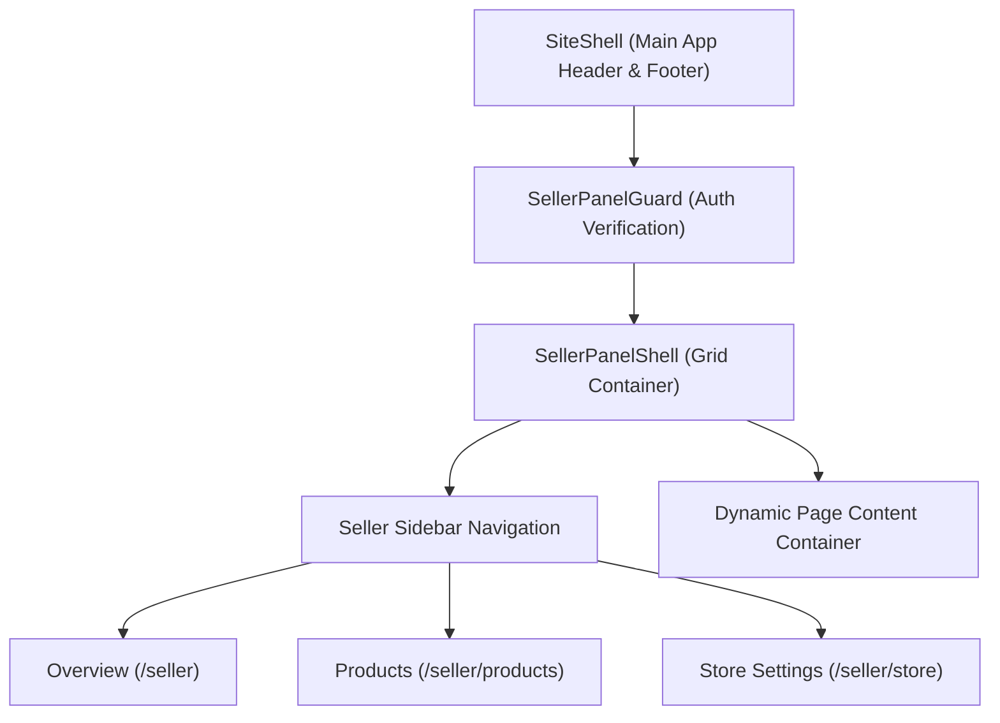

# 06.1. Seller Panel Shell & Layout

The Seller Panel shell located in [`Frontend/src/app/features/seller/components/SellerPanelShell.jsx`](file:///h:/Omid/Code/Velora/Frontend/src/app/features/seller/components/SellerPanelShell.jsx) provides a structured layout for store administration.

---

## 1. Shell Components & Layout

---

## 2. Guarding & Security (`SellerPanelGuard.jsx`)

The seller shell is wrapped in `SellerPanelGuard`, which:
1. Inspects `auth.storeOwner` in Redux.
2. Checks whether token hydration has completed.
3. If unauthenticated, displays an access-restricted state with a direct trigger for `openSellerPopup()`, preventing unauthorized users from accessing merchant settings.

---

## 3. Navigation Sidebar Features

- **Store Identity**: Displays the current store name and country/city location.
- **Quick Links**:
  - **Overview**: High-level store metrics and summary widgets.
  - **Products**: Table of active inventory with filters and "Add Product" button.
  - **Store Profile**: Edit store description, address, and contact details.
- **Responsive Layout**: Collapses smoothly into a mobile drawer on smaller screen viewports.
