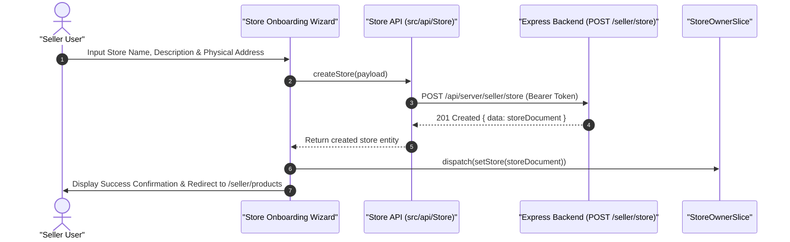

# 06.2. Store Onboarding & Settings Management

Velora simplifies merchant onboarding through guided store creation and ongoing settings configuration at `/seller/store`.

---

## 1. Store Onboarding Flow

---

## 2. Store Configuration Attributes

Merchants configure their public storefront profile with the following fields:

- **Store Name**: Displayed on all public product cards and storefront headers.
- **Description**: Merchant mission, brand story, and specialty.
- **Country & Province / State**: Tax and geographic origin region.
- **City & Address**: Physical headquarters and warehouse dispatch origin.
- **Zipcode / Postal Code**: Routing reference for delivery estimations.

---

## 3. Store Data Mutations

- **Update**: Allows sellers to modify store descriptions and contact addresses seamlessly via `PATCH /api/server/seller/store/:id`.
- **Soft Delete**: Enables sellers to deactivate their storefront via `DELETE /api/server/seller/store/:id`, which recursively deactivates related product listings while preserving historical order logs.
