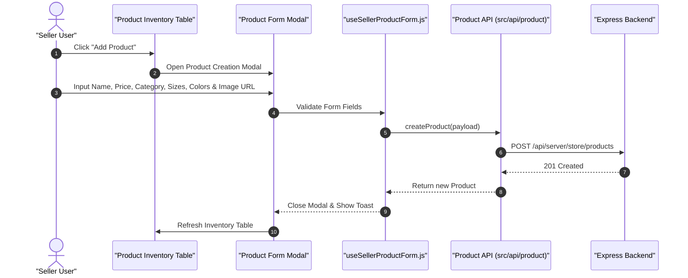

# 06.3. Seller Product Lifecycle & Inventory Management

The product management dashboard at `/seller/products` allows merchants to create, edit, manage variants, and soft-delete product listings.

---

## 1. Product Lifecycle Sequence

---

## 2. Product Form Fields & Attributes

- **Basic Information**: Title (`name`), detailed Markdown description (`description`).
- **Pricing & Discounts**: Regular price (`oldPrice`), sale price (`newPrice`), computed discount badge (`discount`).
- **Category Hierarchy**: Root category (e.g. `Clothing`) and subcategory (e.g. `Jackets`).
- **Media**: Primary image URL (`imageUrl`) and optional gallery URLs.
- **Variant Options**: Multi-value chips for available `color` options and `size` selections.
- **Highlights & Details**: Bullet-point product features rendered on the product detail page.
- **Promotional Flags**: `NewArrivals` toggle for home page showcase inclusion.

---

## 3. Product Actions

- **Instant Edit**: Inline modal for adjusting prices, descriptions, and variant options.
- **Soft Deletion**: Securely flags products as `isDeleted: true`, immediately removing them from the public catalog while preserving integrity for past customer order records.
